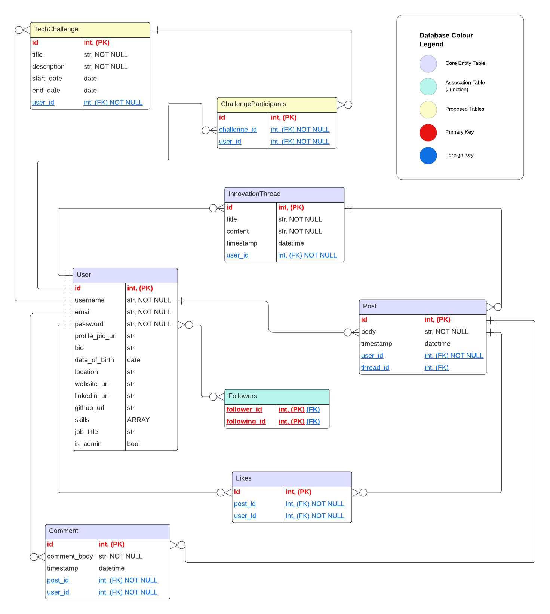
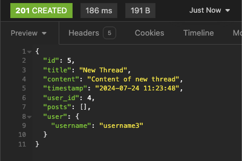

# T2A2_API_Webserver


# 1. Explain the problem that this app will solve, and explain how this app solves or addresses the problem.

This API is designed as a specialised social media platform specifically for software developers; providing a centralised hub to bridge the gap between developers and cutting-edge technology innovation. The platform caters specifically to develoeprs who are interested in experimenting with and contributing to developer who are interested in experimenting with and contributing to emerging technologies: For example, AI, blockchain, quantum computing and emerging programming languages. Users can create posts detailing their experiments, showcase prototypes, and share insights on novel techniques and tools. Similarly, users are also able to engage in "Innovation Threads" that track the development of new ideas and concepts within these fields.

Furthermore, this platform aims to streamline these interactions by consolidating various community-building aspects into one dedicated space. The follower/following feature offers users to customise their feed to include updates on technologies of their interest, influential tech leaders and groundbreaking research. Additionally, the like and comment functionalities are designed to foster engagement and strengthen relationships within the developer community. In addition to traditional social media functionalities, this platform also incorporates features tailored to innovation and collaboration. This approach not only enhances commnication and collaboration but also ensures that users can easily navigate and contribute to a vibrant, interconnected network. Users can also create their own "Innovation Threads" in which they can track the development of new ideas within the community and exchange their opinions on emerging technology. Within my ERD I've included a proposed feature called "Tech Challenges", where users can propose and solve technology-related problems. Despite my belief that this is a strong idea, it ultimately wasn't included in the final application due to time constraints.

This application aims to achieve several key objectives. Firstly, it seeks to strengthen community relationships within the tech community. Secondly, it strives to facilitate developer engagement in innovation and by helping the identify gaps in emerging and evolving fields. By staying abreast of trends and offering a welcoming platform for open discussion, this platform will enable community members to meet these goals effectively.


```
- propose this is used internally within a company? -- this may consolidate team relationships, promote professional development, improve product outcomes, create novel solutions in the software domain

- research developer communities
- trends in community engagement
- successful developer platforms

```


# 2. Describe the way tasks are allocated and tracked in your project.


Github project board: https://github.com/users/hsc996/projects/4


## _Github Kanban_


## _Github Roadmap_


I developed an implementation plan using a Kanban board in Github Projects, which outlined tasks based on priority. I also used the "roadmap" view in order to visually represent my task timeline by arranging tasks in order of priority per day. While critical tasks were included early in the planning phase, additional tasks were added as specific errors arose. Similarly, I decided to add the "Innovation Thread" later in the planning process in order to make the design more complex, which can be noted to arise later in the task list.


# 3. List and explain the third-party services, packages and dependencies used in this app.


**1. Flask**

Flask is a light-weight WSGI applicaiton framework for Python which facilitates routing, request handling and response management for web applications. The lightweight nature makes it particularly suitable for microservices architechtures, where small, indeonedent services are easier to develop, deploy and maintain. I've utilised the Flask framework to:

    * Initiilise the main setup file
    * Define routes (endpoints) for handling HTTP requests
    * Manage request and response handling
    * Configure application settings
    * Use Blueprints for modilarizing the application
    * Enable debugging and handle errors effectively

In addtion, I have incorporated several Flask extensions and modules to handle specific elements of the API, enhancing the functionality and flexibility of the application.


**2. Flask-SQLAlchemy**

Flask-SQLAlchemy (F-S) is an extension for Flask that inegrates SQLAlchemy, a crucial Object-Relational Mapping (ORM) tool for Python. Using an ORM like SQLAlchemy reduces boilerplate code and improves maintainability by abstracting the SQL queries  into Python classes and methods, making the codebase more manageable and less error-prone. Within my application, F-S is used to facilitate the interaction between my Flask web application and the PostgreSQL database. Here is how it's used:

* _Database Integration_ --> this package is user to simplify the connection the the PostgreSQL database by providing a configuration interface within my app. For example:
```
app.config["SQLALCHEMY_DATABASE_URI"] = os.environ.get("DATABASE_URL")
```
This example utilises the `os` module to retrieve the database URI from environment variables, which is then passed to F-S to handle the configuration and establish the connection with the database

* _ORM Mapping_ --> Within this application SQLAlchemy is imported from F-S in order to define the models that map to corresponding tables in the database. For example, the `User` class inherits from `db.Model`, which is a base class provided by F-S. This inheritance allows the `User` class to represent a table in PostgreSQL. Attributes of the class (e.g. `id`, `username`, `email`) correspond to columnns in the table. SQLAlchemy handles the translation between these Python class definitions and the database schema, streamlining data manipulation and retrival.

* _Session Management_ --> F-S manages datase session, which are used to interst with the database. It provids a session object for executing queries, committing transactions, and rolling back when necessary. These features make it seamless to execute CRUD (Create, Read, Update, Delete) oeprations (e.g. `db.session.add(new_user)` adds the nuw_user to the session, while `db.session.commit()` commits the transaction, saving the new user to the database).

* _Querying_ --> this extension allows users to build and execute queries using Python code instead of raw SQL. This includes querying records, filtering results and joining tables. The query attribute on models provides methods to retrieve and manipulate data (e.g. `Post.query.filter_by(user_id=user_id).all()` retrieves all posts associated with the given user ID).


**3) Flask-JWT-Extended**

Flask-JWT-Extended is a Flask extension that enables secure JWT (JSON Web Token) authentication. The JWT tokens offer dual functionality, as they can be used to verify user identities and can also be used to restrict assess to certain endpoints based on token validity.

* _Token Creation_ --> the `create_access_token` function generates a token that includes user identity and  other claims. This token is then sent to the client and used in subsequent requests for authentication.

* _Expiration handling_ --> Tokens can be configured to expire after a certain period, enhancing security by limiting the window of time a token is valid. This is managed by setting an `expires_delta` when creating the token, ensuring that user need to re-authenticate periodically.


I've utilised this extension for both of these features within my app; for example, the `jwt_required()` decorator is used within the `delete_comment` endpoint to both authenticate the user of the account and used in conjunction with the `auth_comment_action` decorator to determine whether this use is authorised to perform the "delete comment" action.


**4) Marshmallow**

Marshmallow is a library that is used for serialisation and deserialisation of data within the web application. This means it converts complex data types, like ORM models, to and from JSON format. "Serialisation" refers to the transformation of model instances in JSON data to be returned into API responses. An exmaple within my applicaion is that the `UserSchema` is used to serialise a `User` model instance into JSON format. The `get_user` endpoint the retrieves a user by ID and uses the shcema to convert the use object to JSON. "Deserialisation" validates and parses JSON input data into Python objects for processing. For example, the `create_user` endpoint in my app handles a POST request to create a new user. The `user_schema.load()` method is then used to deserialise the incoming JSNO data into a `User` model instance. Marshomallow's validation capabilities ensure data integrity by allowing you to enforce constraints and rules on input data, which helps prevent errors and maintain consistency.


**5) Bcrypt**

Bcrypt is a library specifically designed to securely hash and check passwords, ensuring user credentials are stored safely. Hashing converts the user's given password into a fixed-length string of characters, which is secure and irreversible. Bcrypt automatically adds a unique salt to each password hash, ensuring identical passwords have different hashes. Salting is a critical aspect of bcrypt's security model, as it helps protect against rainbow table attacks by ensuring that identical passwords have different hashes due to unique salts. For example: Within the `register_user` controller, I've used `bcrypt.generate_password_hash(password)`, which uses bcrypt to add salt and produces a hash, while `.decode('utf-8')` converts the hash from bytes to a UTF-8 string. This makes it easier to store within the database. Furthermoe, when a user logs in, I use `bcrypt.check_password_hash(user.password, body_data.get("password"))` to retrieve the hashed password from the database and the plain text password from the login attempt. It then hashes the input password using the same salt and algorithm, then compares it to the stored hash. If the passwords match, the user is authenticated.


**6) psycopg2-binary**

The `psycogp2-binary` package is a pre-compiled version of `psycopg2`, which simplifies installation by avoiding the need to compile the library from source. SQLAlchemy uses `psycopg2-binary` under the hood to communicate with the database and handle database sessions, queries and transactions. Within my application the `errorcodes` modules form `psycopg2` is used to handle specific PostgreSQL error codes. For example, checking for `UNIQUE_VIOLATION` to manage unique constraint errors.


**7) datetime**

`datetime` is a built-in Python modules form SQLAlchemy that provides access to SQL functions such as `datetime`, `date`, `time` and `timedelta`. Within this app, I've employed this module to use functions like `datetime` to manage the timestamps on posts and comments. Furthermore, I've also used the `timedelta` function to set an expiry period for the JWT (e.g. `expires_delta=timedelta(days=1)`).


**8) sqlalachmy.func**

`sqlalchemy.func` is a module from SQLAlchemy tha tprovides access to the SQL functions like COUNT, SUM, AVG, etc. These function can be used in SQL queries to perform aggregate operations and other SQL operations directly from SQLAlchemy. For example, I've imported `func` in the Post and Comment models like so `timestamp = db.Column(db.DateTime, default=func.now())`. The use of `func.now()` calls this SQL function to ensure that everytime a new record is inserted into the database, the `timestamp` column is automatically set to the current date and time (without needing to manually specify it within the application code).


**9) os**

`os` is a built-in Python module used for interaction with the operating system. It allows access to environment variables, file operations and other OS-level interactions. I use this within my API, I've used `is.environ.get("DATABASE_URL")` to retrieve environment variables to configure the database connection.


**10) functools.wraps**

`functools.wraps` is a decorator from the `functools` modules that is used to preserve the metadata (like the function name, docstring, etc.) of the original function when it is decorated. When creating custom decorators for authentication and authorisation, I've employed the `@wraps` function to ensure that the decorated function retains its original metadata.


**11) sqlalchemy.orm.exc.NoResultFound**

`NoResultFound` is an exception raised by SQLAlchemy when a query that was expected to return a single result does not return any results. I've utilised it for this very purpose within my custom authorisationd decorators to verify the authentication and authorisation of a user:
```
        try:
            like = db.session.query(Like).filter_by(id=like_id).one()
        except NoResultFound:
            return {"error": f"Like with ID {like_id} not found."}, 404
```
Within this example, I've used this exception to handle a case where a "like" is not found in order to handle this error gracefully and return a meaningful error message.


# 4. Explain the benefits and drawbacks of this app’s underlying database system.


PostgreSQL is an advanced, open-source relational database management system (RDBMS) which I've employed as the underlying database system within this API. It supports SQL for relational queries and JSON for non-relational queries, creating a powerful and flexible data framework for a wide range of applications. As a fully ACID-compliant database, PostgreSQL not only ensures reliable transactions and data integrity, but also boasts advanced features; such as complex query capabilities, indexing, full-text search, and support for custom data types and functions.


**Benefits**


_1. ACID Compliance:_ PostgreSQL is fully ACID-compliant, ensuring data integrity, as well as reliable transactions. This is crucial for applications requiring consistent and accurate data.


_2. Advanced Features:_ PostgreSQL provides advance features like complex queries, foreign keys, triggers, views and stored procedures, in order to enable sophisticated data manipulation and the implementation of business logic directly within the database.


_3. Extensibility:_ PostgreSQL's is a highly extensible system, offering a myriad of customisable options to the user to meet their specific application needs. Users can define their own data types, index types, and functional languages. It is also a packaging tool for database add-ons, supporting languages like PL/pgSQL, PL/Python, Java, and even JavaScript; allowing developers to write and run functions in various languages within the database by exposing an interface for language integration. This interface enables seamless execution of functions regardless of their underlying language, thus simplifying complexity by providing an extensible language function. This capability allows larger companies to develop functional packages tailored to their specific business domains.


_4. Performance:_ PostgreSQL supports complex queries, foreign keys, triggers, views, and stored procedures, enabling sophisticated data manipulation and business logic directly within the database. Its powerful indexing and optimization techniques make it suitable for managing large datasets and high-concurrency environments efficiently. Additionally, it uses Multi-Version Concurrency Control (MVCC) to handle concurrent processing and maintain high transaction rates with minimal risk of deadlocks, as well as ensuring high availability and provides server failure recovery mechanisms.


_5. Open Source:_ PostgreSQL being open source is highly beneficial as it is cost-effective, reducing database management expenses since it is free to use. It enjoys strong community support, with a large and active developer base ensuring rapid bug fixes, regular updates, and abundant resources. The open-source nature allows for high flexibility and customization, enabling users to modify the source code to meet specific needs. Additionally, it offers transparency for inspecting code security and reliability, fosters innovation through global collaboration, and avoids vendor lock-in, providing freedom in choosing support and services.


**Drawbacks:**


_1. Complexity:_ Due to its advanced features and extensive configuration options, PostgreSQL can be more complex to set up and maintain compared to simpler databases like SQLite.

_2. Resource Intensive:_ PostgreSQL can be more resource-intensive, requiring more memory and CPU than other databases, which might be a concern for smaller applications or those running on limited hardware.

_4. Learning Curve:_ The richness of features means there is a steeper learning curve for new users or developers who are not familiar with its capabilities and configuration options. It has also been noted that the initial installation may also be difficult for beginners.

_5. Scaling Write Operations:_ While PostgreSQL handles read operations very efficiently, scaling write operations across multiple servers can be challenging and may require additional tools and configurations (e.g., sharding, replication).

_6. Slower performance:_ As this database has a stronger focus on delivering compatibility, the speed of performance has been impacted when compared to other RDBMS like SQL Server and MySQL. It has also been noted that some SELECT queries may be slower than their counterparts. 


# 5. Explain the features, purpose and functionalities of the object-relational mapping system (ORM) used in this app.


The object-relational mapping (ORM) system I have used within this API is SQLAlchemy. I opted to use SQLAlchemy as it provides high-level abstraction for interacting with relational databases. This abstraction simplifies database oeprations, enhances code readability and reduces risk of SQL injection.


_1) Mapping Classes (Models) to Tables_

Within the "models" folder is a series of files, each containing the models and schema of each main data table. Each 'entity' in the ERD are translated into SQLAlchemy models: Within my code, the `InnovationThread`, `User`, `Post`, `Comment`, `Like` and `Follower` classes are the models I've created, passing the `(db.Model)` attribute so that SQLAlchemy can recognise these classes are the objects to be mapped into the relational database as tables. Each of the attributes within the ERD are defined as columns using `db.Column` and data types and constraints are specified (e.g. `comment_body = db.Column(db.String, nullable=False)`). This is necessary in order for SQLAlchemy to understand how to accurately translate the data into the database.


_2) Schema Definition_

In addition to defining models, SQLAlchemy works with Marshmallow to handle schema definitions. While SQLAlchemy maps models to database tables, Marshmallow provides provides a way to serialise and deserialise the data to and from JSON format.

For example, the `UserSchema` class uses Marshmallow to specify how use data should be converted to and from JSON:
```
class UserSchema(ma.Schema):
    threads = fields.List(fields.Nested('InnovationThreadSchema', exclude=["user"]))
    posts = fields.List(fields.Nested('PostSchema', exclude=["user"]))
    comments = fields.List(fields.Nested('CommentSchema', exclude=["user"]))
    likes = fields.List(fields.Nested('LikeSchema', exclude=["user"]))
    followers = fields.List(fields.Nested('UserSchema', only=["id", "username"]))
    following = fields.List(fields.Nested('UserSchema', only=["id", "username"]))

    email = fields.String(
    required=True,
    validate=validate.Regexp(r"^\S+@\S+\.\S+$", error="Invalid Email Format")
    )
```
This schema defines which fields are included in the JSON representation, validates data (such as email format and password strength), and ensured that the data adheres to expected constraints before it is saved to the database.


_3) Relationships and Associations_

These models are also used to establish the relationships and associations within object relational mapping. Within these models, the relationships (which would mirror those of the ERD) have also be defined using the the 'back_populates' attribute. For example, the use of `user = db.relationship("User", back_populates="threads")` in the "InnovationThread" Model ensures that the `User` model's `threads` attribute is kept in sync, allowing bidirectional access between threads and their associated user. However, these attributes/associations look different depending on the intended nature of the entity relationship. For example, the `User` class has a one-to-many relationship with the `InnovationThread` and `Post` classes, as specified here:
```
threads = db.relationship("InnovationThread", back_populates="user")
posts = db.relationship("Post", back_populates="user")
```
This means that a single user can have multiple threads and posts. Whereas the `Follower` class handles many-to-many relationships between users:
```
follower_id = db.Column(db.Integer, db.ForeignKey('users.id'), primary_key=True)
followed_id = db.Column(db.Integer, db.ForeignKey('users.id'), primary_key=True)

follower = db.relationship("User", foreign_keys=[follower_id], back_populates="following_assoc")
followed = db.relationship("User", foreign_keys=[followed_id], back_populates="followers_assoc")
```
This setup allows users to follow each other, thus facilitating a dynamic social network.


_4) Validation & Constraints_


SQLAlchemy enforces constraints and validations directly within my model definitions. For example, in this `InnovationThread` class, the `title` column has a constraint to ensure that it is not empty and does not exceed 100 characters.
```
    @validates('title')
    def validate_title(self, key, title):
        if not title:
            raise ValueError("Title must not be empty.")
        if len(title) > 100:
            raise ValueError("Title must be at most 100 characters long.")
        return title
```
This ensures that any titles stored in the database adheres to these constraints.

Furthermore, I have also defined unique constraints, such as in the `Follower` class, to ensure that a user cannot follow the same user more than once:
```
    __table_args__ = (
        db.UniqueConstraint('follower_id', 'followed_id', name='unique_follow_pair'),
    )
```

_5) CRUD Operations_

SQLAlchemy simplifies implementing CRUD operations. For instance, creating a new post involves instantiating a Post object and adding it to the session:
```
new_post = Post(
            body=body_data.get("body"),
            timestamp=date.today(),
            user_id=get_jwt_identity()
        )
        db.session.add(new_post)
        db.session.commit()
```
Within this example, I've created a new instance of the `Post` class, providing values for its fields like `body`, `timestamp` and `user_id`. This instance represents the  new record you want to insert into the database. `db.session.add(new_post)` is then used to schedule the new  post to be inserted into the database. SQLAlchemy is used to track the change in this session. `db.session.commit()` is then used to finalise the operation by committing the transaction. While this example only touches on the 'CREATE' operation, similar ORM functionalities are applied to the 'READ', 'UPDATE' and 'DELETE' operations throughout the API.


_6) Querying and Data Retrieval_

SQLAlchemy provides powerful querying capabilities. Instead of writing raw SQL queries, SQLAlchemy's querying methods can be used to interact with the database. The use of this feature of the ORM within the API ultimately simplifies data retrieval and manipulation. Consider this example:
```
@posts_bp.route("/", methods=["GET"])
def get_all_posts():
    stmt = db.select(Post).order_by(Post.timestamp.desc())
    posts = db.session.scalars(stmt)
    if posts is None:
        return {"error": "No posts found."}, 404
    return posts_schema.dump(posts), 200
```
`db.select(Post)` creates a SQLAlchemy `Select` object for querying the `Post` table. It represents a SQL `SELECT` statement that will retrieve records from the `Post` table. `db.session.scalars(stmt)` the executes the query represented within the `stmt` variable and trieves the results. The `scalars()` method returns the result as a list of individual `Post` objects, rather than a list of tuples or rows.


_7) Lazy Loading_

In SQLAlchemy, the `lazy` parameter determines how related objects are loaded when a query is made. I've utilised this feature within my `InnovationTrhead` object, like so: `posts = db.relationship("Post", back_populates="threads", lazy=True, cascade="all, delete-orphan")`. Within this example, the `lazy=True` parameter speicifies that the related `Post` objects should be loaded lazily. This means that when you access the "posts" attribute, SQLAlchemy will issue a separate query to load the posts associate with current instance (thread).


# 6. Design an entity relationship diagram (ERD) for this app’s database, and explain how the relations between the diagrammed models will aid the database design. 
### This should focus on the database design BEFORE coding has begun, eg. during the project planning or design phase.





To ensure a robust and efficient Object-Relational Mapping (ORM) setup for my API, the initial and crucial step is the creation of an Entity Relationship Diagram (ERD). An ERD provides a visual representation of each 'entity' as a table, detailing its attributes; including primary keys (PKs) and foreign keys (FKs). This diagram is instrumental in comprehansive planning and structuring of the ORM by defining unique identifiers for each table, which ensures that every record can be unniquely referenced and retrieved. Additionally, the ERD maps the relationships between entities: such as, one-to-many, many-to-one and many-to-many, allowing for a clear understanding of how data interrelates. This visual representation of the database is essential for designing the database schema in order to achieve data normalisation, which minimises redundancy and avoids data duplication, thus leading to a more consistent and manageable database. Furthermore, by illustrating FK relationships, the ERD aids in enforing referential integrity, thus ensuring that relationships between table are accurately maintained.

My ERD is comprised of 8 entity tables, each representing a model/table within the database. Each entity has a header, which will ultimately be similar or identical to the names of the model classes within my API. However, I'm aware that I've included entities within this ERD that I may not have time to complete; you will see these represented in yellow to indicate they are "proposed" additional features. Each entity table has two columns; the left columns contain the attributes, while the right column contains the data type/contraints, and/or key type if applicable. Within my ERD design, I have colour-coded the header of each entity and constructed a "Database Colour Legend" so the viewer is able to easily identify what each colour signifies. This database legend also includes the colour legends of the primary and foreign keys:

* `Core Entity Table` --> these entity tables have been colour coded in purple. I've used this terminology in the database legend so that theoretically, other developers/viewers would be able to see which entities will be decidedly included in the API.
  
* `Association Table` --> the entity tables in green signify the association or junction tables within the database. By highlighting these in a different colour to the "core" entity tables, other developers will be able to delineate that way in which they form a bridge between two core entity tables in order to facilitate many-to-many relationships. Although the `Followers` table does not provide as a junction between two core entities, it still fosters a many-to-many relationship between `User` and `Followers` tables, thus can still be considered an association table.
  
* `Proposed Tables` --> the entity tables that have been colour-coded yellow signify "proposed" tables. In theory, these tables represent proposed features to add to the API; which would be a very useful feature, particularly when collaborating within a development team. In the context of my API, they represent proposed additional features that I would like to incorporate if I feel as though I can complete them within the allotted time.
  
* `Primary Key` --> in order to promote consistency and clarification, I've colored the primary keys and their associated data type in red: This is also outlined in the database legend. Furthermore, to elucidate these elements further, I have placed them in bold text and identified them using a `(PK)` notation. This allows the viewer to find these key elements faster.
  
* `Foreign Key` --> the database legend identifies that the foreign keys can be found in blue. I decided to colour the text of the foreign key attribute, data type and constraint of each entity blue. Similarly to the primary key legend, I also decided to make these even more identifiable by underlining the text and placing a `(FK)` notation besides each of them.


I have used traditional ERD symbols in order to represent the relationships between the entities. The double line represents 'one-and-only-one', while the cirle with the extending crows foot symbol represents 'none-or-many'. For example, the line connecting the tables `User` and `Post` entities has a double line at the "user" end and the cirle crows foot symbol at the "post" end. This is because one (and only one) user can create many (or none, if they so desire) posts. Thus, as zero or many posts can belong to a single user, these symbols accurately represent the relationship between these two models. These symbols have been intentionally excluded from the database legend as they are customary and hence widely regonisable within a software development team.

At first glance, one is able to see that this ERD adheres to the First Normal Form (1NF) of data normalisation, as each entity contains a single primary key to ensure unique records and every column contains atomic values (e.g. `username`, `email`). Furthermore, it also adheres to Second Normal Form (2NF) as all non-key attributes depend entirely on the primary key. This is apparent as all key attributes depend on the entire primary key; for example, the use of the `ChallengeParticipants` junction table will mean that the `challenge_id` and `user_id` together form the composite key in order to handle many-to-many relationships. Similary, the elimination of transitive dependencies also means that the ERD adheres to the Third Normal Form (3NF) of data normalisation. For example, within the `Followers` table, both `follower_id` and `following_id` are part of the composite primary key, ensuring each relationship is both uniquely and directly tied to the primary key. The ERD also conforms to the Boyce-Codd Normal Form (BCNF), as each determinant is a candidate key and there and no partial dependencies or transitive dependencies not addressed. It is likely that this ERD conforms to Fourth Normal Form (4NF) and Fifth Normal Form (5NF) as there are no apprent multiple-valued dependencies or complex join dependencies. However, this is difficult to delineate without specific use cases, as specific contexts may recover additional hidden dependencies. For example, within the `Tech Challenges` participants are able to join multiple challenges, and each challenge can have multiple paritcipants. Suppose each pariticpant in a challenge has aspecific roels or resources that depend on both the challenge and particiipant, forming a 3 way relationship. This would require the introduction of another joint table (e.g. `ChallengeRolesResources`)
to handle these dependencies and avoid data redundancy.

Consider the `User` table: if one of the optional attributes was "skills" with the data type "array", allowing developers to list their programming skills, this would impact which level of data normalisation the ERD adheres to. In this scenario, we are introducing a multi-value dependency within a single entity, which leaves the database vulnerable to data duplication or redundancy. In this context, it would not pass the 4NF level and would thus reduce the highest achieved normalisation level to 3NF overall.


# 7. Explain the implemented models and their relationships, including how the relationships aid the database implementation.
### This should focus on the database implementation AFTER coding has begun, eg. during the project development phase.


**1) InnovationThread Model**

This model allows the user to create a thread to facilitate innovative ideas and spark discussion with other platform users. Each attribute of this table is defined as a column, specifying the data types and constraints for each attribute. For example, the thread `id` is identified as both an integer and the primary key (`id = db.Column(db.Integer, primary_key=True)`). When posting a thread, I've ensured that the title and content (original post to start the thread) cannot be null as indicated by the `nullable=False` attributes. I've also imported the `datetime` module in order to include a timestamp of when the thread was originally created, which is set to default at the current time (`db.Column(db.DateTime, default=func.now())`). This model also includes the `user_id` as a foreign key, as this is an original attribute of the `User` model; it is linked here in order identify the creator of the thread. A many-to-one relationship is established with the `User` model, as each thread is associated with one user. Including `user = db.relationship("User", back_populates="threads")` in the model enables the retrieval of the user who created the thread. Similarly, `posts = db.relationship("Post", back_populates="threads", lazy=True, cascade="all, delete-orphan")` establishes a one-to-many relationship with the `Post` model as each thread can have multiple posts. Furthermore, the `cascade="all, delete-orphan"` option ensures that if a thread is deleted, all associated posts are also deleted. When using the "POST" method for the "/threads" route, `user_id=get_jwt_identity()` is used to extract the creator's information so that the user_id can be retrieved using the queries in the "GET" methods.

I've created four separate CRUD operations specifically for posts on threads, included in the `post_controller.py` file; the queries of which reference these relationships within the InnovationThread model in order to retrieve information from the User and Post objects. For example, in order to retrieve all posts on a specific thread (`get_all_posts_in_thread`), it begins a query to select records from the `Post` table using `db.select(Post)`, then uses `.filter_by(thread_id=thread_id)` to filter the posts to only include those with a `thread_id` that match the thread_id specified in the route. In order for this to work, the relationship to the `Post` object must exist within the `InnovationThread` model and vice versa (`threads = db.relationship("InnovationThread", back_populates="posts")` within the `Post` model). The thread_id must also be included in the Post model as a foerign key.

Therefore, when I seed the Postgres database, I should be able to see `id` (thread, PK), `title`, `content`, `timestamp` and `user_id` as the columns within the "thread" table:


**2) User Model**


The User Model involves all the attributes typically found in a customary social media profile. Similarly, to the InnovationThread model, this model defines the `id` (user_id) as the primary key of the table (`primary_key=True`). Although this will be the unique identifier, the user will also be able to set their own username, password and email in order to register and log into their account. All 3 of these are core attributes, and have thus been made not nullable fields. Furthermore, the email must be unique in order to be able to register the account. In order for the user to be able to use the platform for professional networking, I've allowed a series of optional attributes for the user to include in order to share more information about themselves to their followers: `profile_picture_url`, `bio`, `date_of_birth`, `location`, `website_url`, `linkedin_url`, `github_url`, `skills`, `job_title`. The `is_admin` attribute will default to False, thus must be specified by the administrator in order to be registered as such.

There are a series of relationship that have been established within this model, as all of the other models involve operations that can only be executed by the users:

`threads` --> establishes a one-to-many relationship with the `InnovationThread` model, as each user can create multiple threads.

`posts` --> establishes a one-to-many relationship with the `Post` model, as each user can create multiple posts.

`comments` --> establishes a one-to-many relationship with the `Comment` model, as each user can make mutiple comments.

`likes` --> establishes a one-to-many relationship with the `Like` model, as each user can like multiple posts.

`followers_assoc` --> establishes a many-to-many self-referential relationship for tracking users who are followed.

`following_assoc` --> establishes a many-to-many self-referential relationship for tracking users who follow others.

Once the database is seeded, I will be able to see all of these columns within the Postgres database:


If we look at the controller of one of these relationships, such as the "POST" method for comment, we can see the way this relationship is incorporated:
```
        comment = Comment(
            comment_body=comment_body,
            timestamp=date.today(),
            post_id=post.id,
            user_id=get_jwt_identity()
        )
```
Within this example, `user_id=get_jwt_identity()` is used to retireve the current user' ID from the JWT in order to identify and track the creator of the comment within the database.
All of these attributes allow for a comprehensive user profile, particularly for individuals looking to foster new professional connections using the platform. Furthermore, relationships between models facilitates interconnectivity throughout the API.


**3) Post Model**


The post model allows the user to post from their account. The core attributes within this model involve the `id` (post_id) as the primary key, the `body` of the post (`nullable=False`) and a timestamp of when the post was created (defaults to the current time). There are 2 foreign keys identified within this model: the `user_id`, allowing identification of the user creating the post, and the `threads_id`, in the event that the  posts is posted on an existing thread. Within the `post_controllers.py` file, you will see double the amount of CRUD operations; this is necessary as different end points are required in order to allow the user to post on their main feed vs. on an existing post.

There are 4 relationships established within this model, allowing the model to interact with each respective model:

`threads` --> estiblishes a many-to-one relationship with the 'InnovationThread' model, as many posts may belong to one specific thread. Having said that, the posts do not have to have a relationship with a thread and can be posted to the main feed, depending on the end point selected.

`user` --> establishes a many-to-one relationship with the `User` model, as each post is created by a specific user.

`comments` --> establishes a one-to-many relationship with the `Comment` model, as each post can have multiple comments.

`likes` --> establishes a one-to-many relationship with the `Like` model, as each post can be liked by multiple users.

The posts model allows the user to post to their main feed and within organised thread discussions. Furthermore, the relationship between this model and the 'Like' and 'Comment' models enables useer interation. When the database is seeded, we will see all of the defined columns within this model:


Let's review an example of why these relationships are necessary. When examining the relationship between the `Post` and `Like` objects, we can look at the queries used within the controllers to identify the relationship:
```
def get_post_likes(post_id):
    stmt = db.select(Post).filter_by(id=post_id)
    post = db.session.scalar(stmt)

    if post is None:
        return {"error": f"Post with ID {post_id} not found."}, 404
        
    likes = Like.query.filter_by(post_id=post.id).all()
    return likes_schema.dump(likes), 200
```
 Within the `get_post_likes` method, `db.select(Post).filter_by(id=post_id)` is used to first query the `Post` table for the post with the given post_id, with `db.session.scalar(stmt)` executing the select statement and returning a single result (the post) if it exists. Furthermore, `Like.query.filter_by(post_id=post.id).all()` uses SQLAlchemy to query the `Like` table and filters by post_id to reitreve all the likes associated with the post. In this way, the relationship established with the `Like` model is crucial as the "like" function entirely depends on whether or not a post exists.


**4) Comment Model**


The comment model is designed to allow the user to comment on posts; they can either post on posts on their main feed or posts within exitsting threads. The `id` within the model has been defined as the primary key (`primary_key=True`), which means that this attribute can be used to uniquely identify each comment. Furthermore, the comment will require a body of content (`comment_body`), which is why I've made this attribute not nullable. Lastly, I've included a timestamp, which uses a SQLAlchemy `func` import to set the default timestamp to the current time. There are 2 necessary foreign keys defined within this model: the `user_id` and the `post_id`. For this reason, relationships have been established between this model and both the `User` and `Post` models:
```
user = db.relationship("User", back_populates="comments")
posts = db.relationship("Post", back_populates="comments")
```

`user` --> esablishes a many-to-one relationship, as each comment is associated with a single user (the account from which the comment is posted). Within the "POST" operation in the comment controllers, `user_id=get_jwt_identity()` is used to retireve the current user' ID from the JWT in order to identify and track the creator of the comment within the database.

`post` --> estbalishes a many-to-one relationship, as each comment is associated with one post (the post on which the user is commenting). Let's examine an example from the "POST" method in the comment controllers:
```
        body_data = request.get_json()
        stmt = db.select(Post).filter_by(id=post_id)
        post = db.session.scalar(stmt)
```
Within this code example, `db.select(Post)` initialises a query to select records from the `Post` table, while `.filter_by(id=post_id)` adds a filter condition to query to match the post with the `post_id` specified in the route. `db.session.scalar(stmt)` is then used to execute the query. This is necessary as the first step before executing the rest of the code, as the operation must find a post on which to comment before allowing the user to execute a comment. By examining this query, we're able to understand the relationship between the `Comment` and `Post` objects and why it's necessary that they're established within the models.

After seeding the database, I will be able to see the columns as: `id` (comment_id, PK), `comment_body_`, `timestamp`, `user_id` (FK) and `post_id` (FK), as shown below:


**5) Like Model**


The `Like` model represents the action of a user liking a post. This model includes an `id` (like_id) as the primary key (`primary_key=True`), which uniquely identifies each like record within the database. The `user_id` and `post_id` fields are foreign keys that link to the `User` and `Post` models, respectively.

`user` --> establishes a many-to-one relationship with the `User` model, as each like is associated with a single user but one user is able like multiiple posts. `db.relationship("User", back_populates="likes")` ensured that the `User` models's `likes` relationship is kept synchronised. Let's review an example of how this relationship is referenced in a query:
```
@likes_bp.route("/", methods=["GET"])
def get_post_likes(post_id):
    stmt = db.select(Post).filter_by(id=post_id)
    post = db.session.scalar(stmt)

    if post is None:
        return {"error": f"Post with ID {post_id} not found."}, 404
        
    likes = Like.query.filter_by(post_id=post.id).all()
    return likes_schema.dump(likes), 200
```
Within this snippet of code, `db.select(Post).filter_by(id=post_id)` creates a query to find the `Post` with the specified `post_id`, while `db.session.scalar(stmt)` executes the query to get the `Post` object. Furthermore, `Like.query.filter_by(post_id=post.id).all()` finds all records associated witht he retrieved `Post` object using the post_id. This query demonstrates a many-to-one relationship between "likes" and "posts".


`posts` --> establishes a many-to-one relationship with the `Post` model, as each like is associated with a single post. `db.relationship("Post", back_populates="likes")` ensures that the `Post` model's `likes` relationship is kept synchronised. Let's review an example of where this relationship is demonstrated:
```
# Like a post - POST - /post/<int:post_id>/likes
@likes_bp.route("/", methods=["POST"])
@jwt_required()
def like_post(post_id):
    try:
        user_id = get_jwt_identity()
        stmt = db.select(Post).filter_by(id=post_id)
        post = db.session.scalar(stmt)

        if not post:
            return {"error": f"Post with ID {post_id} not found."}, 404
        
        if str(post.user_id) == str(user_id):
            return {"error": f"You cannot like your own post."}, 403
        
        existing_like = Like.query.filter_by(user_id=user_id, post_id=post.id).first()
        if existing_like:
            return {"error": f"Post with ID {post_id} already liked."}, 400
        
        new_like = Like(
            user_id=user_id,
            post_id=post.id
        )
        db.session.add(new_like)
        db.session.commit()
        return like_schema.dump(new_like), 201
```
Within this snippet of code, the JWT is stored as a variable `user_id` and refernced later in the code: `Like.query.filter_by(user_id=user_id, post_id=post.id).first()` is a query used to check whether the current user has already liked the specified post. In order for this to be executed, it must utilise the relationship established between `Like` and `User/Post`.

After seeding the database, the column displayed should involve `id` (like_id, PK), `user_id` (FK) and `post_id` (FK):


# 8. Explain how to use this application’s API endpoints. Each endpoint should be explained, including the following data for each endpoint:
## * HTTP verb
## * Path or route
## * Any required body or header data
## * Response


## USER ENDPOINTS


**FETCH A USER'S PROFILE**

* _HTTP verb:_ GET
* _PATH/ROUTE:_ http://127.0.0.1:8080/auth/user/1 (/auth/user/<int:user_id>)
* _BODY/HEADER REQUIRED:_ No body data or specific headers are required for this method. One does not need to be authorised/JWT is not required to use this endpoint.
* _SUCCESSFUL REPONSE EXAMPLE:_ A successful response should return a JSON dictionary of all of the specified user's profile details, their posts and other user's comments/likes on those posts:

 

* _UNSUCCESSFUL REPONSE EXAMPLE:_ If no matching user_id is found, a 404 error message will be returned:
```
{
    "error: "User with ID {user_id} not found."
}
```


**REGISTER NEW PROFILE**

* _HTTP verb:_ POST
* _PATH/ROUTE:_ http://127.0.0.1:8080/auth/register (/auth/register)
* _BODY/HEADER REQUIRED:_ In order to register an account, the only fields required in the body data is `username`, `email` and `password`. The payload should contain these 3 fields and their associated attributes in JSON format. Here's an example of the body data:
```
{
	"username": "username5",
	"email": "user5@email.com",
	"password": "password1234"
}
```
* _SUCCESSFUL REPONSE EXAMPLE:_ In the scenario provided above, the user created would only have the required (not nullable) fields in reponse, and a successful response would look something like this:


Here's an example of how it would look if the user decided to include more profile details in the optional fields:


* _UNSUCCESSFUL REPONSE EXAMPLE:_ Here are a series of potential error messages that may arise depending on the issue:

    


**LOGIN TO ACCOUNT**

* _HTTP verb:_ POST
* _PATH/ROUTE:_ http://127.0.0.1:8080/auth/login (/auth/login)
* _BODY/HEADER REQUIRED:_ In order to login to an account, the only fields required in the body data are `email` and `password`. The payload should contain these 2 fields and their associated attributes in JSON format. Here's an example of the body data:
```
{
	"email": "admin@email.com",
	"password": "123456"
}
```
* _SUCCESSFUL REPONSE EXAMPLE:_ While using the example above, as it is an admin account, a successful response would return `"is_admin": true`, whereas this would usually be "false" by default. Every reponse will return the `email`, `is_admin` and `token` fields; the latter of which should be a JWT token hashed by Bcrypt:


* _UNSUCCESSFUL REPONSE EXAMPLE:_ Should the user attempt to login with an invalid or unregistered email address, or get their password wrong, a 401 error message will be returned:
```
{
    "error": "Invalid email or password"
}
```
If the system catches any another database-related issues that might occur during the query, the user will receive a 500 error message:
```
{
    "error": "Database error"
}
```


**EDIT USER PROFILE**

* _HTTP verb:_ PUT, PATCH
* _PATH/ROUTE:_ http://127.0.0.1:8080/auth/editprofile/4 (/auth/editprofile/<int:user_id>)
* _BODY/HEADER REQUIRED:_ Using this route, the owner of the profile should be able to update any of the fields in their profile, except their email address. The body data can edit any of these fields: `username`, `password`, `profile_picture_url`, `bio`, `date_of_birth`, `location`, `website_url`, `linkedin_url`, `github_url`, `job_title`. Here's an example of a valid payload:
```
{
	"username": "newusername",
	"location": "San Diego, CA",
	"job title": "Software Engineer"
}
```
Furthermore, a valid JWT is required to perform this action.

* _SUCCESSFUL REPONSE EXAMPLE:_ For this endpoint, I've included an `auth_user_action` decorator which checks whether the JWT token provided matches the `user_id` passed in the the URL in order to authorise whether the user is the owner of the account before allowing them to perform this action. This decorator will also allow the administrator to perform this action. This is what a successful reponse example would look like:


* _UNSUCCESSFUL REPONSE EXAMPLE:_ Should the account not belong to the user or admin accounts, an error message will be returned informing the user that they are not allowed to perform this action:


If not JWT is provided, this error message will be returned:


If the user attempts to edit their own email address, this error message will be returned:


If there is no valid user_id that matches the id passed in the URL, this error message will be returned:


**DELETE PROFILE**

* _HTTP verb:_ DELETE
* _PATH/ROUTE:_ http://127.0.0.1:8080/auth/deleteprofile/4 (/auth/deleteprofile/<int:user_id>)
*  _BODY/HEADER REQUIRED:_ This endpoint should allow the user to delete their account, including all associated threads, posts, comments and likes executed by this account. Furthermore, it should delete all posts, comments and likes associated with his deleted content. It will do this automatically, so no body data or headers will be required in the payload. However, a valid JWT token matching the user_id passed in the URL will be required.
* _SUCCESSFUL REPONSE EXAMPLE:_ A successful response will return a message, notifying the user that the action was successful:


* _UNSUCCESSFUL REPONSE EXAMPLE:_ For this endpoint, I've included an `auth_user_action` decorator which checks whether the JWT token provided matches the `user_id` passed in the the URL in order to authorise whether the user is the owner of the account before allowing them to perform this action. This decorator will also allow the administrator to perform this action. Should the account not belong to the user or admin accounts, an error message will be returned informing the user that they are not allowed to perform this action:


If not JWT is provided, this error message will be returned:


If there is no valid user_id that matches the id passed in the URL, this error message will be returned:


## POST ENDPOINTS


**FETCH ALL POSTS**

* _HTTP verb:_ GET
* _PATH/ROUTE FOR POSTS FROM MAIN FEED:_ http://127.0.0.1:8080/posts
* _PATH/ROUTE FOR POSTS FROM A SPECIFIC THREAD:_ http://127.0.0.1:8080/posts/threads/1 (/posts/threads/<int:thread_id>)
* _BODY/HEADER REQUIRED FOR MAIN FEED AND THREAD:_ No body data or specific headers are required for this method. One does not need to be authorised/JWT is not required to use this endpoint.
* _SUCCESSFUL RESPONSE EXAMPLE FOR MAIN FEED AND THREAD:_ A successful response should return a list of posts within the database on JSON format, ordered by the post `id` in descending order. It should return each of the thread attributes: `id`, `body`, `timestamp`. Furthermore, it should display the `user_id` and `username` of the creator, as well as all associated comments and likes. A successful post retrieval would look like this:


* _UNSUCCESSFUL RESPONSE EXAMPLE ON MAIN FEED:_ If no posts on the main feed are found, this error message will occur (404):
```
{
    "error": "No posts found."
}
```
* _UNSUCCESSFUL RESPONSE EXAMPLE FOR POSTS ON A SPECIFIC THREAD:_
If no posts are found when fetching posts on a specific thread, this error message will occur (404):
```
{
    "error": "No posts found in Thread with ID {thread_id}."
}
```


**FETCH A SINGLE POST**

* _HTTP verb:_ GET
* _PATH/ROUTE FOR POSTS FROM MAIN FEED:_ http://127.0.0.1:8080/posts/3 (/posts/<int:posts_id>)
* _PATH/ROUTE FOR POSTS FROM A SPECIFIC THREAD:_ http://127.0.0.1:8080/posts/6/threads/1 (posts/<int:post_id>/threads/<int:thread_id>)
* _BODY/HEADER REQUIRED FOR MAIN FEED AND THREAD:_ No body data or specific headers are required for this method. One does not need to be authorised/JWT is not required to use this endpoint.
* _SUCCESSFUL RESPONSE EXAMPLE FOR MAIN FEED AND THREAD:_ A successful response should return a single JSON dictionary containing the `id`, `body`, `timestamp`, `user_id` and `username` of the creator, as well as all associated comments and likes for this post:


* _UNSUCCESSFUL RESPONSE EXAMPLE ON MAIN FEED:_ If this post is on the main feed and is not found, this error message will occur (404):
```
{
    "error": "Post with ID {post_id} not found."
}
```
* _UNSUCCESSFUL RESPONSE EXAMPLE FOR POSTS ON A SPECIFIC THREAD:_ If no posts are found when fetching posts on a specific thread, this error message will occur (404):
```
{
    "error": "Post with ID {post_id} not found in Thread with ID {thread_id}."
}
```


**CREATE A POST**

* _HTTP verb:_ POST
* _PATH/ROUTE FOR POSTS FROM MAIN FEED:_ http://127.0.0.1:8080/posts
* _PATH/ROUTE FOR POSTS FROM A SPECIFIC THREAD:_ http://127.0.0.1:8080/posts/threads/2 (/posts/threads/<int:thread_id>)
* _BODY/HEADER REQUIRED FOR MAIN FEED AND THREAD:_ The only required body data required in the payload is the `body` field in JSON format. This is an example of what the payload should look like:
```
{
	"body": "This is a new post!"
}
```
It will also require a JWT token to authenticate the user before allowing it to execute. If the token is missing, it will return this error:


* _SUCCESSFUL RESPONSE EXAMPLE FOR MAIN FEED AND THREAD:_ A successful response should return a single JSON dictionary containing the `id`, `body`, `timestamp`, `user_id` and `username` of the creator, as well as all associated comments and likes for this post:


* _UNSUCCESSFUL RESPONSE EXAMPLE FOR MAIN FEED AND THREAD:_ Should the body be left empty or include only whitespace, the system will return this error message:

 or 

* _UNSUCCESSFUL RESPONSE EXAMPLE FOR POST ON THREAD:_ If the thread is not found, a 404 error message will be displayed:
```
{
    "error": "Thread with ID {thread_id} not found."
}
```


**EDIT/UPDATE AN EXISTING POST**

* _HTTP verb:_ PUT, PATCH
* _PATH/ROUTE FOR POSTS FROM MAIN FEED:_ http://127.0.0.1:8080/posts/1 (/posts/<int:post_id>)
* _PATH/ROUTE FOR POSTS FROM A SPECIFIC THREAD:_ http://127.0.0.1:8080/posts/threads/1 (/post/<int:post_id>/threads/<int:thread_id>)
* _BODY/HEADER REQUIRED FOR MAIN FEED AND THREAD:_ Like the POST method, the payload will require body data addressing the `body` field in JSON format. Here is an example:
```
{
		"body": "This comment had been updated"
}
```
Both routes will also require a JWT token to authenticate the user before allowing it to execute. Both endpoints also requires further user authorisation, meaning editing of the post will only be executed if the JWT token belongs to the original creator of the post or administator of the platform. If no JWT is provided, this error will be returned:


And if a JWT is provided but does not belong to the post creator or admin, they will return this error:


* _SUCCESSFUL RESPONSE EXAMPLE FOR MAIN FEED AND THREAD:_ A successful response should return a single JSON dictionary containing the `id`, `body`, `timestamp`, `user_id` and `username` of the creator, as well as comments/likes associated with the post, with the updated fields displaying the new information:


* _UNSUCCESSFUL RESPONSE EXAMPLE FOR MAIN FEED AND THREAD:_ Should the body be left empty or include only whitespace, the system will return this error message:

 or 

* _UNSUCCESSFUL RESPONSE EXAMPLE FOR MAIN FEED:_ If the post is not found, a 404 error message will be returned like this:
```
{
    "error": "Post with ID {post_id} not found."
}
```
* _UNSUCCESSFUL RESPONSE EXAMPLE FOR POST ON THREAD FEED:_ If the post is not found, a 404 error message will be returned like this:
```
{
    "error": "Post with ID {post_id} not found in Thread with ID {thread_id}."
}
```


**DELETE A POST**

* _HTTP verb:_ DELETE
* _PATH/ROUTE FOR POSTS FROM MAIN FEED:_ http://127.0.0.1:8080/posts/ (/posts/<int:post_id>)
* _PATH/ROUTE FOR POSTS FROM A SPECIFIC THREAD:_ http://127.0.0.1:8080/posts/2/threads/3 (/post/<int:post_id>/threads/<int:thread_id>)
* _BODY/HEADER REQUIRED FOR MAIN FEED AND THREAD:_ No body data or specific headers are required for this method. However, this endpoint requires authentication with a JWT token. Just like the update method, the user must also be authorised to delete a post: therefore, the JWT token must belong to the creator or administator of the platform. If no JWT is provided, this error will be returned:


And if a JWT is provided but does not belong to the post creator or admin, it will return this error:


* _SUCCESSFUL RESPONSE EXAMPLE:_ A successful response should simply return a message indicating that the action was successful:


* _UNSUCCESSFUL RESPONSE EXAMPLE FOR MAIN FEED:_ If the post is not found, a 404 error message will be returned like this:
```
{
    "error": "Post with ID {post_id} not found."
}
```
* _UNSUCCESSFUL RESPONSE EXAMPLE FOR POST ON THREAD FEED:_ If the post is not found, a 404 error message will be returned like this:
```
{
    "error": "Post with ID {post_id} not found in Thread with ID {thread_id}."
}
```


## COMMENT ENDPOINTS


**FETCH ALL COMMENTS ON A POST**

* _HTTP verb:_ GET
* _PATH/ROUTE:_ http://127.0.0.1:8080/posts/1/comments (/posts/<int:post_id>/comments)
* _BODY/HEADER REQUIRED:_ No body data or specific headers are required for this method. One does not need to be authorised/JWT is not required to use this endpoint.
* _SUCCESSFUL REPONSE EXAMPLE:_ A successful response should return a list of JSON dictionaries of all of the comments associated with the post identified by post_id in the endpoint. It will also return the `body`, `timestamp` and `thread_id` (if applicable) associated with the comment. Here is an example:


* _UNSUCCESSFUL REPONSE EXAMPLE:_ If no matching post_id is found, the system will return a 404 error like this:


If the post exists but there are no comments associated with that post, the system will return a message like this:


**FETCH ONE SPECIFIC COMMENT**

* _HTTP verb:_ GET
* _PATH/ROUTE:_ http://127.0.0.1:8080/posts/1/comments/1 (/posts/<int:post_id>/comments/<int:comment_id>)
* _BODY/HEADER REQUIRED:_ No body data or specific headers are required for this method. One does not need to be authorised/JWT is not required to use this endpoint.
* _SUCCESSFUL REPONSE EXAMPLE:_ A successful response should return a JSON dictionary of all of the comments associated with the post identified by post_id in the endpoint. It will also return the `body`, `timestamp` and `thread_id` (if applicable) associated with the comment. Here is an example:


* _UNSUCCESSFUL REPONSE EXAMPLE:_ If no matching post_id is found, the system will return a 404 error like this:


If the post exists but the `comment_id` provided does not match the `post_id` provided, the system will return a message like this:


**POST A COMMENT**

* _HTTP verb:_ POST
* _PATH/ROUTE:_ http://127.0.0.1:8080/posts/1/comments (/posts/<int:post_id>/comments)
* _BODY/HEADER REQUIRED:_ The body data will require a `comment_body` to be passed in order to successfully execute this endpoint. Furthermore, a JWT token is required, as the system needs to be able to recognise the account from which the comment is posted.
* _SUCCESSFUL REPONSE EXAMPLE:_ A successful response should return a JSON dictionary including the `id` (comment_id), `comment_body`, `timestamp`. It also will return the "username" from the `user` field and the `body`, `timestamp` and `thread_id` (if applicable) of the associated post. Here is an example:


* _UNSUCCESSFUL REPONSE EXAMPLE:_ If no matching post_id is found, the system will return a 404 error like this:


If the `comment_body` is empty or isn't between 1-200 characters, a bad reuqest error will be returned:


**EDIT A COMMENT**

* _HTTP verb:_ PUT, PATCH
* _PATH/ROUTE:_ http://127.0.0.1:8080/posts/1/comments/1 (/posts/<int:post_id>/comments/<int:comment_id>)
* _BODY/HEADER REQUIRED:_ The body data will require a `comment_body` to be passed in order to successfully execute this endpoint. Furthermore, a JWT token is required, as the system needs to be able to recognise the account from which the comment is posted. Further authorisation has been added to this endpoint, requiring the JWT provided to belong to either the owner of the comment or an administrator in order for it to be successfully executed.
* _SUCCESSFUL REPONSE EXAMPLE:_ A successful response should return a JSON dictionary including the `id` (comment_id), `comment_body`, `timestamp`. It also will return the "username" from the `user` field and the `body`, `timestamp` and `thread_id` (if applicable) of the associated post. Here is an example:


* _UNSUCCESSFUL REPONSE EXAMPLE:_ If no matching post_id is found, the system will return a 404 error like this:


If the `comment_body` is empty or isn't between 1-200 characters, a bad reuqest error will be returned:


If the JWT token provided does not match the owner of the account or is not an admin account, this error message will be returned:


**DELETE A COMMENT**

* _HTTP verb:_ DELETE
* _PATH/ROUTE:_ http://127.0.0.1:8080/posts/1/comments/1 (/posts/<int:post_id>/comments/<int:comment_id>)
* _BODY/HEADER REQUIRED:_ No body data or specific headers are required for this method. However, a JWT token is required, as the system needs to be able to recognise the account from which the comment is posted. Further authorisation has been added to this endpoint, requiring the JWT provided to belong to either the owner of the comment or an administrator in order for it to be successfully executed. 
* _SUCCESSFUL REPONSE EXAMPLE:_ A successful response for this endpoint should return a message indicating to the user that this action has been performed:


* _UNSUCCESSFUL REPONSE EXAMPLE:_ If no matching post_id is found, the system will return a 404 error like this:


If the JWT token provided does not match the owner of the account or is not an admin account, this error message will be returned:


## LIKE ENDPOINTS

**FETCH ALL LIKES ON A POST**

* _HTTP verb:_ GET
* _PATH/ROUTE:_ http://127.0.0.1:8080/posts/1/likes (/post/<int:post_id>/likes)
* _BODY/HEADER REQUIRED:_ No body data or specific headers are required for this method. One does not need to be authorised/JWT is not required to use this endpoint.
* * _SUCCESSFUL REPONSE EXAMPLE:_ A successful response should return a list of JSON dictionaries of all of the likes associated with the post identified by post_id in the endpoint. Each response should contain the `id` (like_id), as well as the `username` of the user who posted the like. It should also display the `id` (post_id) of the associated post. Here is an example of retrieving all of the likes on post with ID "2":


* _UNSUCCESSFUL REPONSE EXAMPLE:_ If no matching post_id is found, the system will return a 404 error like this:


**LIKE A POST**

* _HTTP verb:_ POST
* _PATH/ROUTE:_ http://127.0.0.1:8080/posts/1/likes (/posts/<int:post_id>/likes)
* _BODY/HEADER REQUIRED:_ Although POST methods usually require body data, this endpoint does not require any as there is no content being posted. A JWT token is required to use this endpoint, as the system needs to authenticate the account/user attempting to post the like.
* _SUCCESSFUL REPONSE EXAMPLE:_ A successful response should contain the `id` (like_id) created, as well as the `username` of the user who posted the like. It should also display the `id` (post_id) of the associated post.


* _UNSUCCESSFUL REPONSE EXAMPLE:_ If no matching post_id is found, the system will return a 404 error like this:


If the user attempts to like a post that they own, a 403 error message will be returned:


If the use has already liked the post, a 400 error message will be returned:


**DELETE A COMMENT**

* _HTTP verb:_ DELETE
* _PATH/ROUTE:_ http://127.0.0.1:8080/posts/1/likes/1 (/post/<int:post_id>/likes/<int:like_id>)
* _BODY/HEADER REQUIRED:_ No body data or specific headers are required for this method. However, a JWT token is required, as the system needs to be able to recognise the account from which the comment is posted. Further authorisation has been added to this endpoint, requiring the JWT provided to belong to either the owner of the comment or an administrator in order for it to be successfully executed. 
* _SUCCESSFUL REPONSE EXAMPLE:_ A successful response for this endpoint should return a message indicating to the user that this action has been performed:


* _UNSUCCESSFUL REPONSE EXAMPLE:_ If no matching post_id is found, the system will return a 404 error like this:


If the JWT token provided does not match the owner of the account or is not an admin account, this error message will be returned:


## THREAD ENDPOINTS


**FETCH ALL THREADS**

* _HTTP verb:_ GET
* _PATH/ROUTE:_ http://127.0.0.1:8080/threads
* _BODY/HEADER REQUIRED:_ No body data or specific headers are required for this method. One does not need to be authorised/JWT is not required to use this endpoint.
* _SUCCESSFUL RESPONSE EXAMPLE:_ A successful response should return a list of threads within the database on JSON format, ordered by the thread `id` in descending order. It should return each of the thread attributes: `id`, `title`, `content`, `timestamp`. Furthermore, it should display the `user_id` of the creator, as well as the associated posts within the thread.


**FETCH A SINGLE THREAD**

* _HTTP verb:_ GET
* _PATH/ROUTE:_ http://127.0.0.1:8080/threads/2 (/threads/<int:thread_id>)
* _BODY/HEADER REQUIRED:_ No body data or specific headers are required for this method. One does not need to be authorised/JWT is not required to use this endpoint.
* _SUCCESSFUL RESPONSE EXAMPLE:_ A successful response should return a single JSON dictionary containing the `id`, `title`, `content`, `timestamp`, `user_id` of the creator, as well as posts associated with the thread.


**CREATE A THREAD**

* _HTTP verb:_ POST
* _PATH/ROUTE:_ http://127.0.0.1:8080/threads
* _BODY/HEADER REQUIRED:_ The only required body data required in the payload is the `title` and `content` fields in JSON format. This is an exmaple of what the payload should look like:
```
{
	"title":"New Thread",
	"content": "Content of new thread"
}
```
It will also require a JWT token to authenticate the user before allowing it to execute. If the token is missing, it will return this error:


* _SUCCESSFUL RESPONSE EXAMPLE:_ A successful response should return a single JSON dictionary containing the `id`, `title`, `content`, `timestamp`, `user_id` of the creator, as well as posts associated with the thread:



* _UNSUCCESSFUL RESPONSE EXAMPLE:_ Should the body be left empty or include only whitespace, the system will return this error message:


**EDIT/UPDATE AN EXISTING THREAD**

* _HTTP verb:_ PUT, PATCH
* _PATH/ROUTE:_ http://127.0.0.1:8080/threads/3 (/threads/<int:thread_id>)
* _BODY/HEADER REQUIRED:_ Like the POST method, the payload will require body data addressing the `title` and `content` fields in JSON format. Here is an example:
```
{
	"title": "Updating thread",
	"content": "Content edited"
}
```
It will also require a JWT token to authenticate the user before allowing it to execute. This endpoint also requires further user authorisation, meaning editing of the thread will only be executed if the JWT token belongs to the original creator of the thread or administator of the platform. If no JWT is provided, this error will be returned:


And if a JWT is provided but does not belong to the thread creator or admin, it will return this error:


* _SUCCESSFUL RESPONSE EXAMPLE:_ A successful response should return a single JSON dictionary containing the `id`, `title`, `content`, `timestamp`, `user_id` of the creator, as well as posts associated with the thread, with the updated fields displaying the new information:


**DELETE A THREAD**

* _HTTP verb:_ DELETE
* _PATH/ROUTE:_ http://127.0.0.1:8080/threads/3 (/threads/<int:thread_id>)
* _BODY/HEADER REQUIRED:_ No body data or specific headers are required for this method. However, this endpoint requires authentication with a JWT token. Just like the update method, the user must also be authorised to delete a thread: therefore, the JWT token must belong to the creator or administator of the platform. If no JWT is provided, this error will be returned:


And if a JWT is provided but does not belong to the thread creator or admin, it will return this error:


* _SUCCESSFUL RESPONSE EXAMPLE:_ A successful response should simply return a message indicating that the action was successful:


## FOLLOWER ENDPOINTS


**FETCH ALL FOLLOWERS OF A USER**

* _HTTP verb:_ GET
* _PATH/ROUTE:_ http://127.0.0.1:8080/users/1/followers (/users/<int:user_id>/followers)
* _BODY/HEADER REQUIRED:_ No body data or specific headers are required for this method. One does not need to be authorised/JWT is not required to use this endpoint.
* _SUCCESSFUL RESPONSE EXAMPLE:_ This endpoint should display a list of accounts following the specified user. A successful response should return a list of JSON dictionaries containing the field `follower_id`, displaying the `id` of the users following the user, and the `followed_id`, which should correlate to the user_id user in the endpoint. This is an example of a successful response in receiving the list of followers for `user_id`/`followed_id` "2":


* _UNSUCCESSFUL RESPONSE EXAMPLE:_ If the user ID in the endpoint cannot be found, a 404 error message will be returned:


**FETCH USERS A SPECIFIC USER IS FOLLOWING**

* _HTTP verb:_ GET
* _PATH/ROUTE:_ http://127.0.0.1:8080/users/1/following (/users/<int:user_id>/following)
* _BODY/HEADER REQUIRED:_ No body data or specific headers are required for this method. One does not need to be authorised/JWT is not required to use this endpoint.
* _SUCCESSFUL RESPONSE EXAMPLE:_ This endpoint should display a list of accounts being followed by the specified user. A successful response should return a list of JSON dictionaries containing the field `follower_id`, which should correlate with the user_id passed in the endpoint, and the `followed_id`, which should correlate with the user_id of the account following the user identified in the endpoint. This is an example of a successful response:


* _UNSUCCESSFUL RESPONSE EXAMPLE:_ If the user ID in the endpoint cannot be found, a 404 error message will be returned:


If the user is not following anyone, a 200 message will be returned to the user:


**FOLLOW AN ACCOUNT**

* _HTTP verb:_ POST
* _PATH/ROUTE:_ http://127.0.0.1:8080/users/follow (/users/follow)
* _BODY/HEADER REQUIRED:_ Within the payload, a `followed_id` will need to be provided on JSON format. This should contain the number of the ID of the account they wish to follow. Here is an example of a valid payload:
```
{
	"followed_id": 4
}
```
* _SUCCESSFUL RESPONSE EXAMPLE:_ This endpoint should display a list of accounts being followed by the specified user. A successful response should return a list of JSON dictionaries containing the field `follower_id`, which should correlate with the user_id passed in the endpoint, and the `followed_id`, which should correlate with the user_id of the account following the user identified in the endpoint. This is an example of a successful response:


* _UNSUCCESSFUL RESPONSE EXAMPLE:_ If the user ID in the endpoint cannot be found, a 404 error message will be returned:


If the user attempts to follow themselves, a 400 error message will be returned:


If the use attempts to follow someone they are already following, a 400 error message will be returned:


**DELETE A THREAD**

* _HTTP verb:_ DELETE
* _PATH/ROUTE:_ http://127.0.0.1:8080/users/1/unfollow (/users/<int:user_id>/unfollow)
* _BODY/HEADER REQUIRED:_ No body data or specific headers are required for this method. However, a JWT token is required, as the system needs to be able to recognise the account from which the comment is posted. Further authorisation has been added to this endpoint, requiring the JWT provided to belong to either the owner of the comment or an administrator in order for it to be successfully executed.
* _SUCCESSFUL RESPONSE EXAMPLE:_  A successful response will return a message to the user indicating that the action has been performed:
  

  
  
* _UNSUCCESSFUL RESPONSE EXAMPLE:_ If the user ID in the endpoint cannot be found, a 404 error message will be returned:


If the user is already not following this user, a 400 error message will be returned:


If JWT is provided but does not belong to the thread creator or admin, it will return this error:


# REFERENCES


https://www.geeksforgeeks.org/normal-forms-in-dbms/

PostgreSQL vs. SQL Server: What’s the difference? (no date) Google Cloud. Available at: https://cloud.google.com/learn/postgresql-vs-sql#section-8.

Mastering Relational Database Structure (2024) myscale.com. Available at: https://myscale.com/blog/essential-components-relational-database-structure/#the-logical-structure-tables-keys-and-relationships
