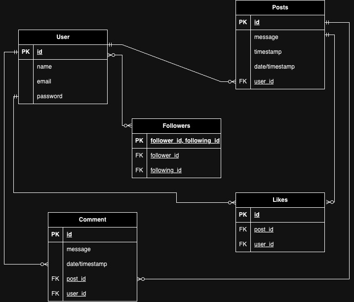

# T2A2_API_Webserver


### 1. Explain the problem that this app will solve, and explain how this app solves or addresses the problem.

This API is designed as a specialised social media platform specifically for software developers; providing a centralised hub to bridge the gap between developers and cutting-edge technology innovation. The platform caters specifically to develoeprs who are interested in experimenting with and contributing to developer who are interested in experimenting with and contributing to emerging technologies: For example, AI, blockchain, quantum computing and emerging programming languages. Users can create posts detailing their experiments, showcase prototypes, and share insights on novel techniques and tools. Similarly, users are also able to engage in "Innovation Threads" that track the development of new ideas and concepts within these fields.

Furthermore, this platform aims to streamline these interactions by consolidating various community-building aspects into one dedicated space. The follower/following feature offers users control over their feed, ensuring that content is tailored to their interests and visibility preferences. Additionally, the like and comment functionalities are designed to foster engagement and strengthen relationships within the developer community. In addition to traditional social media functionalities, this platform also incorporates features tailored to innovation and collaboration. This approach not only enhances commnication and collaboration but also ensures that users can easily navigate and contribute to a vibrant, interconnected network.


```
Users can participate in "Tech Challenges," where they can propose and solve technology-related problems, engage in "Innovation Threads" that track the development of new ideas, and collaborate on open-source projects within the platform. The follower/following system allows users to customize their feeds to include updates on technologies of their interest, influential tech leaders, and groundbreaking research.

The platform also includes a "Tech Trends" feature that aggregates and highlights the latest advancements and discussions in various tech fields, keeping users at the forefront of industry developments. This unique approach not only fosters a community centered around technological innovation but also provides a dedicated space for developers to drive and participate in the future of technology.

objective references and statistics to support this answer
- mention the competitors: Linkedin, Medium, Stackoverflow, Reddit, Substack

```

### 2. Describe the way tasks are allocated and tracked in your project.
**includes proof of thorough usage of specific task management tools through the length of the project**

Github project board: https://github.com/users/hsc996/projects/4


_Github Kanban_


_Github Roadmap_


I developed an implementation plan using a Kanban board in Github Projects, which outlined tasks based on priority. I also used the "roadmap" view in order to visually represent my task timeline by arranging tasks in order of priority per day. While critical tasks were included early in the planning phase, additional tasks were added as specific errors arose. Similarly, I decided to add the "Innovation Thread" later in the planning process in order to make the design more complex, which can be noted in the task list.


### 3. List and explain the third-party services, packages and dependencies used in this app.


### 4. Explain the benefits and drawbacks of this app’s underlying database system.


### 5. Explain the features, purpose and functionalities of the object-relational mapping system (ORM) used in this app.

The object-relational mapping (ORM) system I have used within this API is SQLAlchemy. I opted to use SQLAlchemy as it provides high-level abstraction for interacting with relational databases. In this particular API, the database I have employed is PostgreSQL.


_1) Entity Relationship Diagram_

To ensure a robust ORM setup for my API, the first step is creating an Entity Relationship Diagram (ERD). The ERD presents a visual representation of each table, including their attributes, primary keys and foreign keys, as well as the relationships between the tables. This approach defines unique identifiers, enforces referential integreity and aids in promoting data normalisation to minmise data redundancy and duplication.


_2) Mapping Classes (Models) to Tables_

Within the "models" folder is a series of files, each containing the models and schema of each main data table. Each 'entity' in the ERD are translated into SQLAlchemy models: Within my code, the `InnovationThread`, `User`, `Post`, `Comment`, `Like` and `Follower` classes are the models I've created, passing the `(db.Model)` attribute so that SQLAlchemy can recognise these classes are the objects to be mapped into the relational database as tables. Each of the attributes within the ERD are defined as columns using `db.Column` and data types and constraints are specified (e.g. `comment_body = db.Column(db.String, nullable=False)`). This is necessary in order for SQLAlchemy to understand how to accurately translate the data into the database.


_3) Relationships and Associations_

These models are also used to establish the relationships and associations within object relational mapping. Within these models, the relationships (which would mirror those of the ERD) have also be defined using the the 'back_populates' attribute. For example, the use of `user = db.relationship("User", back_populates="threads")` in the "InnovationThread" Model ensures that the `User` model's `threads` attribute is kept in sync, allowing bidirectional access between threads and their associated user. However, these attributes/associations look different depending on the intended nature of the entity relationship. For example, the `User` class has a one-to-many relationship with the `InnovationThread` and `Post` classes, as specified here:
```
threads = db.relationship("InnovationThread", back_populates="user")
posts = db.relationship("Post", back_populates="user")
```
This means that a single user can have multiple threads and posts. Whereas the `Follower` class handles many-to-many relationships between users:
```
follower_id = db.Column(db.Integer, db.ForeignKey('users.id'), primary_key=True)
followed_id = db.Column(db.Integer, db.ForeignKey('users.id'), primary_key=True)

follower = db.relationship("User", foreign_keys=[follower_id], back_populates="following_assoc")
followed = db.relationship("User", foreign_keys=[followed_id], back_populates="followers_assoc")
```
This setup, in turn, allows users to follow each other, thus facilitating a dynamic social network.


_4) Validation & Constraints_


I have also used SQLAlchemy to enforce data constraints and validations directly within my model definitions. For example, in this `InnovationThread` class, the `title` column has a constraint to ensure that it is not left empty and does not exceed 100 characters.
```
    @validates('title')
    def validate_title(self, key, title):
        if not title:
            raise ValueError("Title must not be empty.")
        if len(title) > 100:
            raise ValueError("Title must be at most 100 characters long.")
        return title
```
This ensures that any titles stored in the database adheres to these constraints.

Furthermore, I have also defined unique constraints, such as in the `Follower` class, to ensure that a user cannot follow the same user more than once:
```
    __table_args__ = (
        db.UniqueConstraint('follower_id', 'followed_id', name='unique_follow_pair'),
    )
```

### 6. Design an entity relationship diagram (ERD) for this app’s database, and explain how the relations between the diagrammed models will aid the database design. 
### This should focus on the database design BEFORE coding has begun, eg. during the project planning or design phase.





To ensure a robust and efficient Object-Relational Mapping (ORM) setup for my API, the initial and crucial step is the creation of an Entity Relationship Diagram (ERD). An ERD provides a visual representation of each 'entity' as a table, detailing its attributes; including primaary keys (PKs) and foreign keys (FKs). This diagram is instrumental in comprehansive planning and structuring of the ORM by defining unique identifiers for each table, which ensures that every record can be unniquely referenced and retrieved. Additionally, the ERD maps the relationships between entities: such as, one-to-many, many-to-one and many-to-many, allowing for a clear understanding of how data interrelates.

This visualisation is essential for designing the database schema in order to achieve data normalisation, which minimises redundancy and avoids data duplication, thus leading to a more consistent and manageable database. Furthermore, by illustrating FK relationships, the ERD aids in enforing referential integrity, thus ensuring that relationships between table are accurately maintained.


### 7. Explain the implemented models and their relationships, including how the relationships aid the database implementation.
### This should focus on the database implementation AFTER coding has begun, eg. during the project development phase.


### 8. Explain how to use this application’s API endpoints. Each endpoint should be explained, including the following data for each endpoint:
### * HTTP verb
### * Path or route
### * Any required body or header data
### * Response