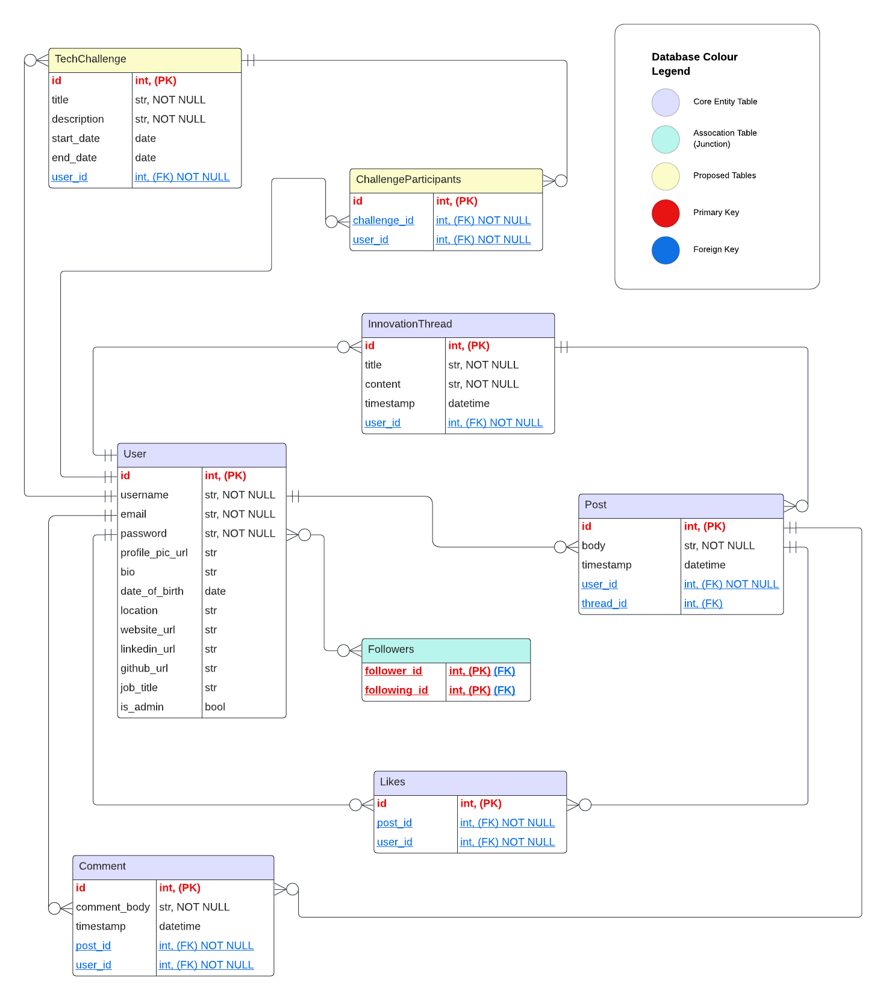

# T2A2_API_Webserver


### 1. Explain the problem that this app will solve, and explain how this app solves or addresses the problem.

This API is designed as a specialised social media platform specifically for software developers; providing a centralised hub to bridge the gap between developers and cutting-edge technology innovation. The platform caters specifically to develoeprs who are interested in experimenting with and contributing to developer who are interested in experimenting with and contributing to emerging technologies: For example, AI, blockchain, quantum computing and emerging programming languages. Users can create posts detailing their experiments, showcase prototypes, and share insights on novel techniques and tools. Similarly, users are also able to engage in "Innovation Threads" that track the development of new ideas and concepts within these fields.

Furthermore, this platform aims to streamline these interactions by consolidating various community-building aspects into one dedicated space. The follower/following feature offers users to customise their feed to include updates on technologies of their interest, influential tech leaders and groundbreaking research. Additionally, the like and comment functionalities are designed to foster engagement and strengthen relationships within the developer community. In addition to traditional social media functionalities, this platform also incorporates features tailored to innovation and collaboration. This approach not only enhances commnication and collaboration but also ensures that users can easily navigate and contribute to a vibrant, interconnected network. Users can also create their own "Innovation Threads" in which they can track the development of new ideas within the community and exchange their opinions on emerging technology. Within my ERD I've included a proposed feature called "Tech Challenges", where users can propose and solve technology-related problems. Despite my belief that this is a strong idea, it ultimately wasn't included in the final application due to time constraints.

This application aims to achieve several key objectives. Firstly, it seeks to strengthen community relationships within the tech community. Secondly, it strives to facilitate developer engagement in innovation and by helping the identify gaps in emerging and evolving fields. By staying abreast of trends and offering a welcoming platform for open discussion, this platform will enable community members to meet these goals effectively.


```
- propose this is used internally within a company? -- this may consolidate team relationships, promote professional development, improve product outcomes, create novel solutions in the software domain

- research developer communities
- trends in community engagement
- successful developer platforms

```


### 2. Describe the way tasks are allocated and tracked in your project.
**includes proof of thorough usage of specific task management tools through the length of the project**

Github project board: https://github.com/users/hsc996/projects/4


#### _Github Kanban_


#### _Github Roadmap_


I developed an implementation plan using a Kanban board in Github Projects, which outlined tasks based on priority. I also used the "roadmap" view in order to visually represent my task timeline by arranging tasks in order of priority per day. While critical tasks were included early in the planning phase, additional tasks were added as specific errors arose. Similarly, I decided to add the "Innovation Thread" later in the planning process in order to make the design more complex, which can be noted in the task list.


### 3. List and explain the third-party services, packages and dependencies used in this app.


### 4. Explain the benefits and drawbacks of this app’s underlying database system.


PostgreSQL is an advanced, open-source relational database management system (RDBMS) which I've employed as the underlying database system within this API. It supports SQL for relational queries and JSON for non-relational queries, creating a powerful and flexible data framework for a wide range of applications. As a fully ACID-compliant database, PostgreSQL not only ensures reliable transactions and data integrity, but also boasts advanced features; such as complex query capabilities, indexing, full-text search, and support for custom data types and functions.


**Benefits**


_1. ACID Compliance:_ PostgreSQL is fully ACID-compliant, ensuring data integrity, as well as reliable transactions. This is crucial for applications requiring consistent and accurate data.


_2. Advanced Features:_ PostgreSQL provides advance features like complex queries, foreign keys, triggers, views and stored procedures, in order to enable sophisticated data manipulation and the implementation of business logic directly within the database.


_3. Extensibility:_ PostgreSQL's is a highly extensible system, offering a myriad of customisable options to the user to meet their specific application needs. Users can define their own data types, index types, and functional languages. It is also a packaging tool for database add-ons, supporting languages like PL/pgSQL, PL/Python, Java, and even JavaScript; allowing developers to write and run functions in various languages within the database by exposing an interface for language integration. This interface enables seamless execution of functions regardless of their underlying language, thus simplifying complexity by providing an extensible language function. This capability allows larger companies to develop functional packages tailored to their specific business domains.


_4. Performance:_ PostgreSQL supports complex queries, foreign keys, triggers, views, and stored procedures, enabling sophisticated data manipulation and business logic directly within the database. Its powerful indexing and optimization techniques make it suitable for managing large datasets and high-concurrency environments efficiently. Additionally, it uses Multi-Version Concurrency Control (MVCC) to handle concurrent processing and maintain high transaction rates with minimal risk of deadlocks, as well as ensuring high availability and provides server failure recovery mechanisms.


_5. Open Source:_ PostgreSQL being open source is highly beneficial as it is cost-effective, reducing database management expenses since it is free to use. It enjoys strong community support, with a large and active developer base ensuring rapid bug fixes, regular updates, and abundant resources. The open-source nature allows for high flexibility and customization, enabling users to modify the source code to meet specific needs. Additionally, it offers transparency for inspecting code security and reliability, fosters innovation through global collaboration, and avoids vendor lock-in, providing freedom in choosing support and services.


**Drawbacks:**


_1. Complexity:_ Due to its advanced features and extensive configuration options, PostgreSQL can be more complex to set up and maintain compared to simpler databases like SQLite.

_2. Resource Intensive:_ PostgreSQL can be more resource-intensive, requiring more memory and CPU than other databases, which might be a concern for smaller applications or those running on limited hardware.

_4. Learning Curve:_ The richness of features means there is a steeper learning curve for new users or developers who are not familiar with its capabilities and configuration options. It has also been noted that the initial installation may also be difficult for beginners.

_5. Scaling Write Operations:_ While PostgreSQL handles read operations very efficiently, scaling write operations across multiple servers can be challenging and may require additional tools and configurations (e.g., sharding, replication).

_6. Slower performance:_ As this database has a stronger focus on delivering compatibility, the speed of performance has been impacted when compared to other RDBMS like SQL Server and MySQL. It has also been noted that some SELECT queries may be slower than their counterparts. 


### 5. Explain the features, purpose and functionalities of the object-relational mapping system (ORM) used in this app.


The object-relational mapping (ORM) system I have used within this API is SQLAlchemy. I opted to use SQLAlchemy as it provides high-level abstraction for interacting with relational databases. This abstraction simplifies database oeprations, enhances code readability and reduces risk of SQL injection.


_1) Mapping Classes (Models) to Tables_

Within the "models" folder is a series of files, each containing the models and schema of each main data table. Each 'entity' in the ERD are translated into SQLAlchemy models: Within my code, the `InnovationThread`, `User`, `Post`, `Comment`, `Like` and `Follower` classes are the models I've created, passing the `(db.Model)` attribute so that SQLAlchemy can recognise these classes are the objects to be mapped into the relational database as tables. Each of the attributes within the ERD are defined as columns using `db.Column` and data types and constraints are specified (e.g. `comment_body = db.Column(db.String, nullable=False)`). This is necessary in order for SQLAlchemy to understand how to accurately translate the data into the database.


_2) Relationships and Associations_

These models are also used to establish the relationships and associations within object relational mapping. Within these models, the relationships (which would mirror those of the ERD) have also be defined using the the 'back_populates' attribute. For example, the use of `user = db.relationship("User", back_populates="threads")` in the "InnovationThread" Model ensures that the `User` model's `threads` attribute is kept in sync, allowing bidirectional access between threads and their associated user. However, these attributes/associations look different depending on the intended nature of the entity relationship. For example, the `User` class has a one-to-many relationship with the `InnovationThread` and `Post` classes, as specified here:
```
threads = db.relationship("InnovationThread", back_populates="user")
posts = db.relationship("Post", back_populates="user")
```
This means that a single user can have multiple threads and posts. Whereas the `Follower` class handles many-to-many relationships between users:
```
follower_id = db.Column(db.Integer, db.ForeignKey('users.id'), primary_key=True)
followed_id = db.Column(db.Integer, db.ForeignKey('users.id'), primary_key=True)

follower = db.relationship("User", foreign_keys=[follower_id], back_populates="following_assoc")
followed = db.relationship("User", foreign_keys=[followed_id], back_populates="followers_assoc")
```
This setup allows users to follow each other, thus facilitating a dynamic social network.


_3) Validation & Constraints_


SQLAlchemy enforces constraints and validations directly within my model definitions. For example, in this `InnovationThread` class, the `title` column has a constraint to ensure that it is not empty and does not exceed 100 characters.
```
    @validates('title')
    def validate_title(self, key, title):
        if not title:
            raise ValueError("Title must not be empty.")
        if len(title) > 100:
            raise ValueError("Title must be at most 100 characters long.")
        return title
```
This ensures that any titles stored in the database adheres to these constraints.

Furthermore, I have also defined unique constraints, such as in the `Follower` class, to ensure that a user cannot follow the same user more than once:
```
    __table_args__ = (
        db.UniqueConstraint('follower_id', 'followed_id', name='unique_follow_pair'),
    )
```


```
4) Schema Definitions and Serialization

To facilitate data transfer, Marshmallow is used for schema definitions and serialization. Each model has a corresponding schema, ensuring data is formatted correctly when sent to clients. For example, UserSchema includes fields for posts, comments, and excludes sensitive information like passwords:
```
class UserSchema(ma.SQLAlchemyAutoSchema):
    class Meta:
        model = User
        exclude = ("password",)
    posts = ma.Nested(PostSchema, many=True)

```
5) CRUD Operations
SQLAlchemy simplifies implementing CRUD operations. For instance, creating a new post involves instantiating a Post object and adding it to the session:
```
new_post = Post(title="New Post", content="Content here", user_id=1)
db.session.add(new_post)
db.session.commit()

```
6) Querying and Filtering
SQLAlchemy provides powerful querying capabilities. For example, filtering posts by a specific user can be done using:
```
user_posts = Post.query.filter_by(user_id=1).all()

```
This enhances efficiency by allowing complex queries with simple syntax.
SQLAlchemy supports transactions and rollbacks, ensuring data integrity. If an operation fails, changes can be rolled back:
```
try:
    db.session.commit()
except Exception:
    db.session.rollback()
    raise

```

7) Transactions and Rollbacks
SQLAlchemy supports transactions and rollbacks, ensuring data integrity. If an operation fails, changes can be rolled back:
```
try:
    db.session.commit()
except Exception:
    db.session.rollback()
    raise

```
This prevents partial updates and maintains database consistency.


SQLAlchemy's ORM features facilitate seamless integration between Python code and relational databases. By abstracting complex database operations, it enhances code readability, security, and maintainability, making it an essential component of this API.

```

### 6. Design an entity relationship diagram (ERD) for this app’s database, and explain how the relations between the diagrammed models will aid the database design. 
### This should focus on the database design BEFORE coding has begun, eg. during the project planning or design phase. (12 POINTS)





To ensure a robust and efficient Object-Relational Mapping (ORM) setup for my API, the initial and crucial step is the creation of an Entity Relationship Diagram (ERD). An ERD provides a visual representation of each 'entity' as a table, detailing its attributes; including primary keys (PKs) and foreign keys (FKs). This diagram is instrumental in comprehansive planning and structuring of the ORM by defining unique identifiers for each table, which ensures that every record can be unniquely referenced and retrieved. Additionally, the ERD maps the relationships between entities: such as, one-to-many, many-to-one and many-to-many, allowing for a clear understanding of how data interrelates. This visual representation of the database is essential for designing the database schema in order to achieve data normalisation, which minimises redundancy and avoids data duplication, thus leading to a more consistent and manageable database. Furthermore, by illustrating FK relationships, the ERD aids in enforing referential integrity, thus ensuring that relationships between table are accurately maintained.

My ERD is comprised of 8 entity tables, each representing a model/table within the database. Each entity has a header, which will ultimately be similar or identical to the names of the model classes within my API. However, I'm aware that I've included entities within this ERD that I may not have time to complete; you will see these represented in yellow to indicate they are "proposed" additional features. Each entity table has two columns; the left columns contain the attributes, while the right column contains the data type/contraints, and/or key type if applicable. Within my ERD design, I have colour-coded the header of each entity and constructed a "Database Colour Legend" so the viewer is able to easily identify what each colour signifies. This database legend also includes the colour legends of the primary and foreign keys:

* `Core Entity Table` --> these entity tables have been colour coded in purple. I've used this terminology in the database legend so that theoretically, other developers/viewers would be able to see which entities will be decidedly included in the API.
  
* `Association Table` --> the entity tables in green signify the association or junction tables within the database. By highlighting these in a different colour to the "core" entity tables, other developers will be able to delineate that way in which they form a bridge between two core entity tables in order to facilitate many-to-many relationships. Although the `Followers` table does not provide as a junction between two core entities, it still fosters a many-to-many relationship between `User` and `Followers` tables, thus can still be considered an association table.
  
* `Proposed Tables` --> the entity tables that have been colour-coded yellow signify "proposed" tables. In theory, these tables represent proposed features to add to the API; which would be a very useful feature, particularly when collaborating within a development team. In the context of my API, they represent proposed additional features that I would like to incorporate if I feel as though I can complete them within the allotted time.
  
* `Primary Key` --> in order to promote consistency and clarification, I've colored the primary keys and their associated data type in red: This is also outlined in the database legend. Furthermore, to elucidate these elements further, I have placed them in bold text and identified them using a `(PK)` notation. This allows the viewer to find these key elements faster.
  
* `Foreign Key` --> the database legend identifies that the foreign keys can be found in blue. I decided to colour the text of the foreign key attribute, data type and constraint of each entity blue. Similarly to the primary key legend, I also decided to make these even more identifiable by underlining the text and placing a `(FK)` notation besides each of them.


I have used traditional ERD symbols in order to represent the relationships between the entities. The double line represents 'one-and-only-one', while the cirle with the extending crows foot symbol represents 'none-or-many'. For example, the line connecting the tables `User` and `Post` entities has a double line at the "user" end and the cirle crows foot symbol at the "post" end. This is because one (and only one) user can create many (or none, if they so desire) posts. Thus, as zero or many posts can belong to a single user, these symbols accurately represent the relationship between these two models. These symbols have been intentionally excluded from the database legend as they are customary and hence widely regonisable within a software development team.

At first glance, one is able to see that this ERD adheres to the First Normal Form (1NF) of data normalisation, as each entity contains a single primary key to ensure unique records and every column contains atomic values (e.g. `username`, `email`). Furthermore, it also adheres to Second Normal Form (2NF) as all non-key attributes depend entirely on the primary key. This is apparent as all key attributes depend on the entire primary key; for example, the use of the `ChallengeParticipants` junction table will mean that the `challenge_id` and `user_id` together form the composite key in order to handle many-to-many relationships. Similary, the elimination of transitive dependencies also means that the ERD adheres to the Third Normal Form (3NF) of data normalisation. For example, within the `Followers` table, both `follower_id` and `following_id` are part of the composite primary key, ensuring each relationship is both uniquely and directly tied to the primary key. The ERD also conforms to the Boyce-Codd Normal Form (BCNF), as each determinant is a candidate key and there and no partial dependencies or transitive dependencies not addressed. It is likely that this ERD conforms to Fourth Normal Form (4NF) and Fifth Normal Form (5NF) as there are no apprent multiple-valued dependencies or complex join dependencies. However, this is difficult to delineate without specific use cases, as specific contexts may recover additional hidden dependencies. For example, within the `Tech Challenges` participants are able to join multiple challenges, and each challenge can have multiple paritcipants. Suppose each pariticpant in a challenge has aspecific roels or resources that depend on both the challenge and particiipant, forming a 3 way relationship. This would require the introduction of another joint table (e.g. `ChallengeRolesResources`)
to handle these dependencies and avoid data redundancy.

Consider the `User` table: if one of the optional attributes was "skills" with the data type "array", allowing developers to list their programming skills, this would impact which level of data normalisation the ERD adheres to. In this scenario, we are introducing a multi-value dependency within a single entity, which leaves the database vulnerable to data duplication or redundancy. In this context, it would not pass the 4NF level and would thus reduce the highest achieved normalisation level to 3NF overall.


### 7. Explain the implemented models and their relationships, including how the relationships aid the database implementation.
### This should focus on the database implementation AFTER coding has begun, eg. during the project development phase.


**1) InnovationThread Model**

This model allows the user to create a thread to facilitate innovative ideas and spark discussion with other platform users. Each attribute of this table is defined as a column, specifying the data types and constraints for each attribute. For example, the thread `id` is identified as both an integer and the primary key (`id = db.Column(db.Integer, primary_key=True)`). When posting a thread, I've ensured that the title and content (original post to start the thread) cannot be null as indicated by the `nullable=False` attributes. I've also imported the `datetime` module in order to include a timestamp of when the thread was originally created, which is set to default at the current time (`db.Column(db.DateTime, default=func.now())`). This model also includes the `user_id` as a foreign key, as this is an original attribute of the `User` model; it is linked here in order identify the creator of the thread. A many-to-one relationship is established with the `User` model, as each thread is associated with one user. Including `user = db.relationship("User", back_populates="threads")` in the model enables the retrieval of the user who created the thread. Similarly, `posts = db.relationship("Post", back_populates="threads", lazy=True, cascade="all, delete-orphan")` establishes a one-to-many relationship with the `Post` model as each thread can have multiple posts. Furthermore, the `cascade="all, delete-orphan"` option ensures that if a thread is deleted, all associated posts are also deleted. When using the "POST" method for the "/threads" route, `user_id=get_jwt_identity()` is used to extract the creator's information so that the user_id can be retrieved using the queries in the "GET" methods.

I've created four separate CRUD operations specifically for posts on threads, included in the `post_controller.py` file; the queries of which reference these relationships within the InnovationThread model in order to retrieve information from the User and Post objects. For example, in order to retrieve all posts on a specific thread (`get_all_posts_in_thread`), it begins a query to select records from the `Post` table using `db.select(Post)`, then uses `.filter_by(thread_id=thread_id)` to filter the posts to only include those with a `thread_id` that match the thread_id specified in the route. In order for this to work, the relationship to the `Post` object must exist within the `InnovationThread` model and vice versa (`threads = db.relationship("InnovationThread", back_populates="posts")` within the `Post` model). The thread_id must also be included in the Post model as a foerign key.

Therefore, when I seed the Postgres database, I should be able to see `id` (thread, PK), `title`, `content`, `timestamp` and `user_id` as the columns within the "thread" table:


**2) User Model**


The User Model involves all the attributes typically found in a customary social media profile. Similarly, to the InnovationThread model, this model defines the `id` (user_id) as the primary key of the table (`primary_key=True`). Although this will be the unique identifier, the user will also be able to set their own username, password and email in order to register and log into their account. All 3 of these are core attributes, and have thus been made not nullable fields. Furthermore, the email must be unique in order to be able to register the account. In order for the user to be able to use the platform for professional networking, I've allowed a series of optional attributes for the user to include in order to share more information about themselves to their followers: `profile_picture_url`, `bio`, `date_of_birth`, `location`, `website_url`, `linkedin_url`, `github_url`, `skills`, `job_title`. The `is_admin` attribute will default to False, thus must be specified by the administrator in order to be registered as such.

There are a series of relationship that have been established within this model, as all of the other models involve operations that can only be executed by the users:

`threads` --> establishes a one-to-many relationship with the `InnovationThread` model, as each user can create multiple threads.

`posts` --> establishes a one-to-many relationship with the `Post` model, as each user can create multiple posts.

`comments` --> establishes a one-to-many relationship with the `Comment` model, as each user can make mutiple comments.

`likes` --> establishes a one-to-many relationship with the `Like` model, as each user can like multiple posts.

`followers_assoc` --> establishes a many-to-many self-referential relationship for tracking users who are followed.

`following_assoc` --> establishes a many-to-many self-referential relationship for tracking users who follow others.

Once the database is seeded, I will be able to see all of these columns within the Postgres database:


If we look at the controller of one of these relationships, such as the "POST" method for comment, we can see the way this relationship is incorporated:
```
        comment = Comment(
            comment_body=comment_body,
            timestamp=date.today(),
            post_id=post.id,
            user_id=get_jwt_identity()
        )
```
Within this example, `user_id=get_jwt_identity()` is used to retireve the current user' ID from the JWT in order to identify and track the creator of the comment within the database.
All of these attributes allow for a comprehensive user profile, particularly for individuals looking to foster new professional connections using the platform. Furthermore, relationships between models facilitates interconnectivity throughout the API.


**3) Post Model**


The post model allows the user to post from their account. The core attributes within this model involve the `id` (post_id) as the primary key, the `body` of the post (`nullable=False`) and a timestamp of when the post was created (defaults to the current time). There are 2 foreign keys identified within this model: the `user_id`, allowing identification of the user creating the post, and the `threads_id`, in the event that the  posts is posted on an existing thread. Within the `post_controllers.py` file, you will see double the amount of CRUD operations; this is necessary as different end points are required in order to allow the user to post on their main feed vs. on an existing post.

There are 4 relationships established within this model, allowing the model to interact with each respective model:

`threads` --> estiblishes a many-to-one relationship with the 'InnovationThread' model, as many posts may belong to one specific thread. Having said that, the posts do not have to have a relationship with a thread and can be posted to the main feed, depending on the end point selected.

`user` --> establishes a many-to-one relationship with the `User` model, as each post is created by a specific user.

`comments` --> establishes a one-to-many relationship with the `Comment` model, as each post can have multiple comments.

`likes` --> establishes a one-to-many relationship with the `Like` model, as each post can be liked by multiple users.

The posts model allows the user to post to their main feed and within organised thread discussions. Furthermore, the relationship between this model and the 'Like' and 'Comment' models enables useer interation. When the database is seeded, we will see all of the defined columns within this model:


Let's review an example of why these relationships are necessary. When examining the relationship between the `Post` and `Like` objects, we can look at the queries used within the controllers to identify the relationship:
```
def get_post_likes(post_id):
    stmt = db.select(Post).filter_by(id=post_id)
    post = db.session.scalar(stmt)

    if post is None:
        return {"error": f"Post with ID {post_id} not found."}, 404
        
    likes = Like.query.filter_by(post_id=post.id).all()
    return likes_schema.dump(likes), 200
```
 Within the `get_post_likes` method, `db.select(Post).filter_by(id=post_id)` is used to first query the `Post` table for the post with the given post_id, with `db.session.scalar(stmt)` executing the select statement and returning a single result (the post) if it exists. Furthermore, `Like.query.filter_by(post_id=post.id).all()` uses SQLAlchemy to query the `Like` table and filters by post_id to reitreve all the likes associated with the post. In this way, the relationship established with the `Like` model is crucial as the "like" function entirely depends on whether or not a post exists.


**4) Comment Model**


The comment model is designed to allow the user to comment on posts; they can either post on posts on their main feed or posts within exitsting threads. The `id` within the model has been defined as the primary key (`primary_key=True`), which means that this attribute can be used to uniquely identify each comment. Furthermore, the comment will require a body of content (`comment_body`), which is why I've made this attribute not nullable. Lastly, I've included a timestamp, which uses a SQLAlchemy `func` import to set the default timestamp to the current time. There are 2 necessary foreign keys defined within this model: the `user_id` and the `post_id`. For this reason, relationships have been established between this model and both the `User` and `Post` models:
```
user = db.relationship("User", back_populates="comments")
posts = db.relationship("Post", back_populates="comments")
```

`user` --> esablishes a many-to-one relationship, as each comment is associated with a single user (the account from which the comment is posted). Within the "POST" operation in the comment controllers, `user_id=get_jwt_identity()` is used to retireve the current user' ID from the JWT in order to identify and track the creator of the comment within the database.

`post` --> estbalishes a many-to-one relationship, as each comment is associated with one post (the post on which the user is commenting). Let's examine an example from the "POST" method in the comment controllers:
```
        body_data = request.get_json()
        stmt = db.select(Post).filter_by(id=post_id)
        post = db.session.scalar(stmt)
```
Within this code example, `db.select(Post)` initialises a query to select records from the `Post` table, while `.filter_by(id=post_id)` adds a filter condition to query to match the post with the `post_id` specified in the route. `db.session.scalar(stmt)` is then used to execute the query. This is necessary as the first step before executing the rest of the code, as the operation must find a post on which to comment before allowing the user to execute a comment. By examining this query, we're able to understand the relationship between the `Comment` and `Post` objects and why it's necessary that they're established within the models.

After seeding the database, I will be able to see the columns as: `id` (comment_id, PK), `comment_body_`, `timestamp`, `user_id` (FK) and `post_id` (FK), as shown below:


**5) Like Model**


The `Like` model represents the action of a user liking a post. This model includes an `id` (like_id) as the primary key (`primary_key=True`), which uniquely identifies each like record within the database. The `user_id` and `post_id` fields are foreign keys that link to the `User` and `Post` models, respectively.

`user` --> establishes a many-to-one relationship with the `User` model, as each like is associated with a single user but one user is able like multiiple posts. `db.relationship("User", back_populates="likes")` ensured that the `User` models's `likes` relationship is kept synchronised. Let's review an example of how this relationship is referenced in a query:
```
@likes_bp.route("/", methods=["GET"])
def get_post_likes(post_id):
    stmt = db.select(Post).filter_by(id=post_id)
    post = db.session.scalar(stmt)

    if post is None:
        return {"error": f"Post with ID {post_id} not found."}, 404
        
    likes = Like.query.filter_by(post_id=post.id).all()
    return likes_schema.dump(likes), 200
```
Within this snippet of code, `db.select(Post).filter_by(id=post_id)` creates a query to find the `Post` with the specified `post_id`, while `db.session.scalar(stmt)` executes the query to get the `Post` object. Furthermore, `Like.query.filter_by(post_id=post.id).all()` finds all records associated witht he retrieved `Post` object using the post_id. This query demonstrates a many-to-one relationship between "likes" and "posts".


`posts` --> establishes a many-to-one relationship with the `Post` model, as each like is associated with a single post. `db.relationship("Post", back_populates="likes")` ensures that the `Post` model's `likes` relationship is kept synchronised. Let's review an example of where this relationship is demonstrated:
```
# Like a post - POST - /post/<int:post_id>/likes
@likes_bp.route("/", methods=["POST"])
@jwt_required()
def like_post(post_id):
    try:
        user_id = get_jwt_identity()
        stmt = db.select(Post).filter_by(id=post_id)
        post = db.session.scalar(stmt)

        if not post:
            return {"error": f"Post with ID {post_id} not found."}, 404
        
        if str(post.user_id) == str(user_id):
            return {"error": f"You cannot like your own post."}, 403
        
        existing_like = Like.query.filter_by(user_id=user_id, post_id=post.id).first()
        if existing_like:
            return {"error": f"Post with ID {post_id} already liked."}, 400
        
        new_like = Like(
            user_id=user_id,
            post_id=post.id
        )
        db.session.add(new_like)
        db.session.commit()
        return like_schema.dump(new_like), 201
```
Within this snippet of code, the JWT is stored as a variable `user_id` and refernced later in the code: `Like.query.filter_by(user_id=user_id, post_id=post.id).first()` is a query used to check whether the current user has already liked the specified post. In order for this to be executed, it must utilise the relationship established between `Like` and `User/Post`.

After seeding the database, the column displayed should involve `id` (like_id, PK), `user_id` (FK) and `post_id` (FK):


### 8. Explain how to use this application’s API endpoints. Each endpoint should be explained, including the following data for each endpoint:
### * HTTP verb
### * Path or route
### * Any required body or header data
### * Response


### REFERENCES


https://www.geeksforgeeks.org/normal-forms-in-dbms/

PostgreSQL vs. SQL Server: What’s the difference? (no date) Google Cloud. Available at: https://cloud.google.com/learn/postgresql-vs-sql#section-8.

Mastering Relational Database Structure (2024) myscale.com. Available at: https://myscale.com/blog/essential-components-relational-database-structure/#the-logical-structure-tables-keys-and-relationships
